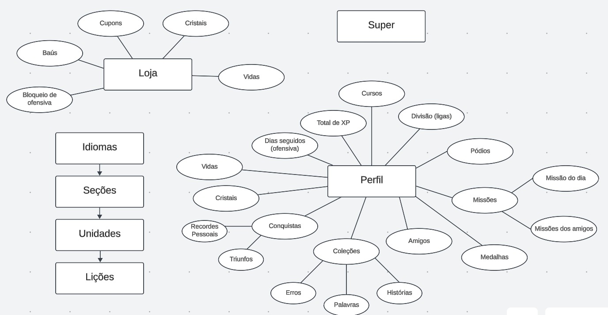

# Observação e Introspecção

## Introdução ao método

### Observação

A observação é um método fundamental na elicitação de requisitos, onde o Engenheiro de Requisitos coleta informações diretamente do ambiente onde o software será utilizado. Esse método se baseia em observar as tarefas realizadas pelos usuários sem interferir ou alterar o ambiente. Através dessa técnica, é possível identificar padrões de uso, entender as necessidades reais dos usuários e capturar requisitos implícitos que muitas vezes não são mencionados em entrevistas ou questionários. Na prática, o Engenheiro de Requisitos pode usar anotações, fotografias, vídeos e outras ferramentas para documentar suas observações e, posteriormente, analisar os dados coletados para extrair requisitos relevantes.

### Introspecção

A introspecção, por sua vez, é uma técnica onde o Engenheiro de Requisitos utiliza sua experiência, conhecimento e criatividade para imaginar as funcionalidades e propriedades desejáveis no sistema a ser desenvolvido. Esse processo envolve uma reflexão profunda sobre como o sistema deve se comportar para atender às necessidades dos usuários. O especialista deve se colocar no lugar dos usuários e pensar em como ele mesmo gostaria de usar o sistema, quais funcionalidades seriam úteis e quais problemas poderiam surgir. A introspecção é particularmente útil quando há uma falta de dados concretos ou quando o sistema é inovador e não há muitos precedentes para se basear.

## Justificativa

A escolha das técnicas de observação e introspecção para a elicitação de requisitos do aplicativo Duolingo foi baseada na necessidade de compreender tanto as funcionalidades explícitas quanto as implícitas do sistema. A observação permite capturar a interação real dos usuários com o aplicativo, identificando suas necessidades e desafios diários. Já a introspecção complementa esse processo, permitindo a antecipação de demandas e funcionalidades que podem não ser evidentes apenas pela observação.

## Metodologia

Como uma das primeiras atividades para entender o aplicativo do Duolingo, foi montado um mapa mental com as principais funcionalidades visíveis no uso do aplicativo, os membros do grupo se reuniram para utilizar cada um separadamente o aplicativo no celular e descrever as principais abas e funcionalidades, gerando o seguinte diagrama no LucidCharts que pode ser observado na figura 01.

**Figura 01** - Primeira versão do mapa mental

Com base no mapa mental gerado, foi feita uma análise com 3 membros do grupo reunidos, observando os principais requisitos funcionais e não-funcionais a serem levantados pela simples observação dos elementos no aplicativo e do mapa mental, tendo em mente o escopo e objetivos do trabalho.

## Requisitos elicitados

Os requisitos identificados podem ser encontrados na composição da tabela 01, contendo os funcionais, e na tabela 02, contendo os não-funcionais.

### Legenda para as Tabelas 01 e 02:

- **RFx**: Requisito Funcional n° x
- **RNFx**: Requisito Não Funcional n° x
- **MMx**: Requisito n° x da técnica do Mapa Mental

### Tabela 01 - Requisitos funcionais

| Tipo | ID | Descrição |
| - | - | - |
| RF01 | <a id="mm01">MM01</a> | O aplicativo deve oferecer uma variedade de idiomas e cursos |
| RF02 | <a id="mm02">MM02</a> | Os cursos oferecidos devem estar divididos em seções |
| RF03 | <a id="mm03">MM03</a> | As seções devem estar divididas em unidades |
| RF04 | <a id="mm04">MM04</a> | As unidades devem estar divididas em níveis |
| RF05 | <a id="mm05">MM05</a> | O aplicativo deve dar feedback para o usuário |
| RF06 | <a id="mm06">MM06</a> | O usuário deve ser capaz de criar e gerenciar seu perfil |
| RF07 | <a id="mm07">MM07</a> | O perfil do usuário deve exibir informações importantes |
| RF08 | <a id="mm08">MM08</a> | O aplicativo deve permitir a adição e interação de amigos |
| RF09 | <a id="mm09">MM09</a> | O aplicativo deve ter missões diárias e missões entre amigos |
| RF10 | <a id="mm10">MM10</a> | O aplicativo deve ter um sistema de recompensas |
| RF11 | <a id="mm11">MM11</a> | O aplicativo deve exibir as coleções de erros, palavras aprendidas e histórias estudadas |
| RF12 | <a id="mm12">MM12</a> | O aplicativo deve rastrear os dias consecutivos de estudo |
| RF13 | <a id="mm13">MM13</a> | O aplicativo deve ter conquistas para marcos específicos no aprendizado |
| RF14 | <a id="mm14">MM14</a> | O aplicativo deve ter um sistema de competições |
| RF15 | <a id="mm15">MM15</a> | O aplicativo deve ter uma loja |
| RF16 | <a id="mm16">MM16</a> | O aplicativo deve suportar compras com dinheiro real |
| RF17 | <a id="mm17">MM17</a> | O aplicativo deve permitir a sincronização com contas de outras plataformas |
| RF18 | <a id="mm18">MM18</a> | o usuário deve ser capaz de gerenciar o seu perfil |
| RF19 | <a id="mm19">MM19</a> | Um nível deve ser dívido em lições |
| RF20 | <a id="mm20">MM20</a> | O usuário deve ser capaz de reportar um problema |
| RF21 | <a id="mm21">MM21</a> | O aplicativo deve fornecer um conjunto de notícias/novidades para o usuario |
| RF22 | <a id="mm22">MM22</a> | O aplicativo permite ao usuário utilizar os seus respectivos itens |

### Tabela 02 - Requisitos não-funcionais

| Tipo | ID | Descrição |
| - | - | - |
| RNF01 | <a id="mm23">MM23</a> | O aplicativo deve possuir gamificação |
| RNF02 | <a id="mm24">MM24</a> | As ligas de competição devem suportar muitos usuários simultâneos |
| RNF03 | <a id="mm25">MM25</a> | O aplicativo deve suportar uma grande quantidade de usuários simultâneos |
| RNF04 | <a id="mm26">MM26</a> | As transações de compras dentro do aplicativo devem ser seguras |
| RNF05 | <a id="mm27">MM27</a> | O aplicativo deve possuir uma interface intuitiva |
| RNF06 | <a id="mm28">MM28</a> | O aplicativo deve ter uma navegação simples |
| RNF07 | <a id="mm29">MM29</a> | As lições de curso devem ter conteúdo confiável e verificado |
| RNF08 | <a id="mm30">MM30</a> | O feedback do aplicativo deve ser imediato |
| RNF08 | <a id="mm31">MM31</a> | O aplicativo poderá ficar no máxima 24 horas inacessível devido a manutenção |
| RNF09 | <a id="mm32">MM32</a> | O aplicativo deve realizar backups regulares |
| RNF10 | <a id="mm33">MM33</a> | O aplicativo deve realizar a sincronização dos dados em nuvem de forma imediata |
| RNF11 | <a id="mm34">MM34</a> | O aplicativo não deve ocupar mais do que 500 MB de armazenamento |
| RNF12 | <a id="mm35">MM35</a> | As resposta a ações do usuário não podem ultrapassar 1,5 segundo |
| RNF13 | <a id="mm36">MM36</a> | O sistema deve suportar versões anteriores |
| RNF14 | <a id="mm37">MM37</a> | O design deve ser responsivo |
| RNF15 | <a id="mm38">MM38</a> | As ilustrações e animações devem seguir um estilo coerente com a identidade visual do aplicativo |

## Gravação

<iframe width="560" height="315" src="https://www.youtube.com/embed/xWtumPgR8cc?si=2Cxp9kjaLBhXd5li" title="YouTube video player" frameborder="0" allow="accelerometer; autoplay; clipboard-write; encrypted-media; gyroscope; picture-in-picture; web-share" referrerpolicy="strict-origin-when-cross-origin" allowfullscreen></iframe>

**Vídeo 01** - Reunião da Elicitação a partir do Mapa Mental

**Autores**: [Felipe Amorim de Araújo](https://github.com/lipeaaraujo), [Raquel Ferreira Andrade](https://github.com/raquel-andrade), [Samuel Alves Silva](https://github.com/samuelalvess)

## Referências

1. Wiegers, Karl Eugene (2013). Software Requirements, 3nd Edition. Disponível em <https://www.booksfree.org/wp-content/uploads/2022/03/Software_Requirements_3rd_Edition_compressed.pdf>. Acesso em: 31 de julho, 2024.

2. Medeiros, Marcelo (2021). Requisitos de Software - Conceitos e Técnicas de Elicitação. Disponível em <https://edisciplinas.usp.br/pluginfile.php/7993139/mod_resource/content/1/05%20-%20Requisitos%20de%20Software%20-%20Conceitos%20e%20T%C3%A9cnicas%20de%20Elicita%C3%A7%C3%A3o.PDF>. Acesso em: 31 de julho, 2024

## Histórico de Versão

| Data | Versão | Descrição | Autor |
| ---- | ------ | --------- | ----- |
| 31/07/2024 | 1.0 | Criação do documento | [Guilherme Silva Dutra](https://github.com/GuiDutra21), [Julio Roberto](https://github.com/JulioR2022), [Felipe Amorim de Araújo](https://github.com/lipeaaraujo), [Raquel Ferreira Andrade](https://github.com/raquel-andrade) |
| 01/08/2024 | 1.1 | Adição da legenda das tabelas | [Raquel Ferreira Andrade](https://github.com/raquel-andrade) |
| 01/08/2024 | 1.2 | Adição das referências | [Felipe Amorim de Araújo](https://github.com/lipeaaraujo), [Guilherme Silva Dutra](https://github.com/GuiDutra21), [Raquel Ferreira Andrade](https://github.com/raquel-andrade) |
| 19/08/2024 | 1.3 | Adição  e modificações em requisitos | [Guilherme Silva Dutra](https://github.com/GuiDutra21), [Julio Roberto](https://github.com/JulioR2022) |
| 10/09/2024 | 1.4 | Corrigindo rastreabilidade dos requisitos | [Felipe Amorim de Araújo](https://github.com/lipeaaraujo) |

