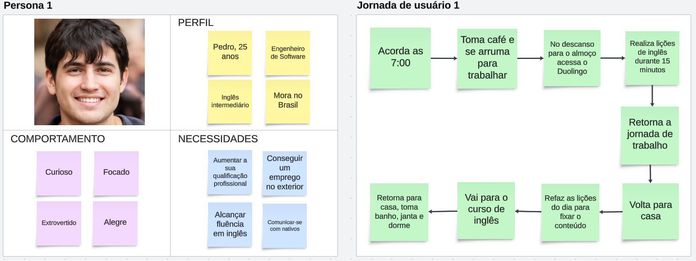
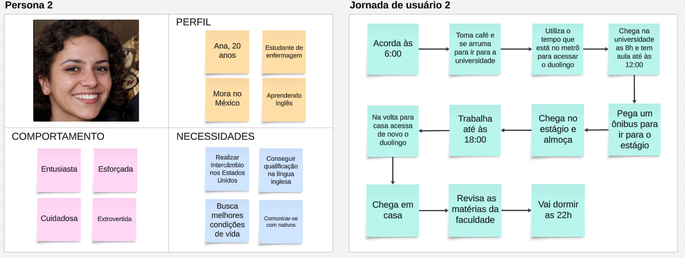
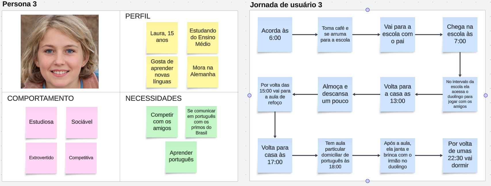

# StoryTelling

## Introdução

O storytelling é uma técnica utilizada na elicitação de requisitos em que os participantes compartilham suas experiências e visões por meio de histórias, que descrevem como lidam com sistemas e com processos, ou como enfrentam desafios. Essa técnica auxilia em uma abordagem com aspectos emocionais, contextuais e comportamentais, que podem não ser evidentes nos métodos tradicionais, além de identificar as expectativas e frustrações dos participantes. 

## Justificativa

A técnica de storytelling foi escolhida para elicitar os requisitos do aplicativo Duolingo por sua capacidade de viabilizar uma visão mais contextualizada das necessidades dos usuários, e uma concepção detalhada em que o sistema será utilizado. Além disto, a partir do mapeamento da jornada do usuário através das histórias, é perceptível uma análise precisa das etapas e interações dos usuários com o aplicativo.

## Metodologia

Para realizar o storytelling os membros do grupo se reuniram e criaram personagens e suas respectivas histórias de usuário. Foram desenvolvidos três perfis de personagens representativos dos diferentes tipos de usuários do sistema, além dos comportamentos e das necessidades de cada um, aspectos importantes para a análise da influência da interação dos usuários com o sistema, e foi elaborado histórias de usuário que descrevem situações reais nas quais os personagens interagem com o aplicativo. Por fim, o grupo mapeou a jornada do usuário, retratando a rotina, e detalhando do início até a conclusão das tarefas realizadas por cada personagem. Essa metodologia forneceu uma visão abrangente e detalhada dos requisitos, permitindo uma abordagem mais centrada no usuário e alinhada com seus comportamentos e necessidades. Os artefatos gerados pelo storytelling pode ser observado nas figuras a seguir. 

**Figura 1** - Persona 1

**Figura 2** - Persona 2

**Figura 3** - Persona 3

## Gravações

<iframe width="560" height="315" src="https://www.youtube.com/embed/OW-2Q-uERm8?si=EzZHCBSaolMIjj5H" title="YouTube video player" frameborder="0" allow="accelerometer; autoplay; clipboard-write; encrypted-media; gyroscope; picture-in-picture; web-share" referrerpolicy="strict-origin-when-cross-origin" allowfullscreen></iframe>

**Vídeo 01** - Elicitação de requisitos a partir do storytelling

**Autores**: [Guilherme Silva Dutra](https://github.com/GuiDutra21), [Julio Roberto](https://github.com/JulioR2022)
  

## Requisitos Elicitados

Os requisitos identificados podem ser encontrados na composição da tabela 01, contendo os funcionais, e na tabela 02, contendo os não-funcionais.

### Legenda para as Tabelas 01 e 02:

- **RFx**: Requisito Funcional n° x
- **RNFx**: Requisito Não-Funcional n° x
- **STx**: Requisito n° x da técnica do Storytelling

### Tabela 01 - Requisitos funcionais

| Tipo | ID | Descrição |
| - | - | - |
| RF01 | ST01 | O aplicativo deve ter lições de fala, escrita, escuta e leitura |
| RF02 | ST02 | O usuário pode refazer as lições |
| RF03 | ST03 | O aplicativo fornece um sistema de revisão  |
| RF04 | ST04 | O aplicativo deve ter um sistema de amizades |
| RF05 | ST05 | O aplicativo deve permitir interação entre amigos |
| RF06 | ST06 | O aplicativo deve ter um sistema de competição |
| RF07 | ST07 | O aplicativo deve fornecer vários cursos de idiomas |
| RF08 | ST08 | O aplicativo deve gerar métricas de desempenho ao final de cada lição |
| RF09 | ST09 | O aplicativo deve permitir o cadastro de usuários |
| RF10 | ST10 | No aplicativo deve ser possível acompanhar o progresso no curso, na própria lição |
| RF11 | ST11 | O aplicativo permite encerrar uma lição prematuramente |

### Tabela 02 - Requisitos não-funcionais

| Tipo | ID | Descrição |
| - | - | - |
| RNF01 | ST12 | O aplicativo deve possuir lições curtas e objetivas |
| RNF02 | ST13 | As lições não podem ser tediosas |
| RNF03 | ST14 | O aplicativo deve ter disponibilidade em qualquer lugar e horário |
| RNF04 | ST15 | O aplicativo deve ser disponível em diversos tipos de aparelhos celulares |
| RNF05 | ST16 | O aplicativo deve ter funcionalidades off-line |
| RNF06 | ST17 | O aplicativo deve testar disponível tanto para crianças, adultos e idosos |
| RNF07 | ST18 | O aplicativo deve ser gamificado |
| RNF08 | ST19 | O aplicativo deve estar disponível em diversos idiomas |
| RNF09 | ST20 | O aplicativo deve permitir o uso de uma mesma conta em mais de um aparelho |

## Referências

1. FERRARI, Priscila. O que é storytelling e como usar em projetos. Disponível em: <https://programathor.com.br/blog/storytelling/>. Acesso em: 31 de julho, 2024

2. UNIVERSIDADE FEDERAL DE SANTA CATARINA. Técnicas de Elicitação de Requisitos - Histórias de Usuário. Retraining. Disponível em: <https://retraining.inf.ufsc.br/guia/app/classificacoes/tecnicas-de-elicitacao-de-requisitos/entidades/tecnicas-de-elicitacao-de-requisitos-historias-de-usuario.> Acesso em: 31 jul. 2024.

## Histórico de versões

| Data | Versão | Descrição | Autor |
| ---- | ------ | --------- | ----- |
| 31/07/2024 | 1.0 | Criação do documento | [Guilherme Silva Dutra](https://github.com/GuiDutra21), [Julio Roberto](https://github.com/JulioR2022), [Felipe Amorim de Araújo](https://github.com/lipeaaraujo), [Raquel Ferreira Andrade](https://github.com/raquel-andrade) |
| 01/08/2024 | 1.1 | Adição da legenda das tabelas | [Guilherme Silva Dutra](https://github.com/GuiDutra21) |
| 01/08/2024 | 1.2 | Adição das referências | [Felipe Amorim de Araújo](https://github.com/lipeaaraujo), [Guilherme Silva Dutra](https://github.com/GuiDutra21), [Raquel Ferreira Andrade](https://github.com/raquel-andrade) |

