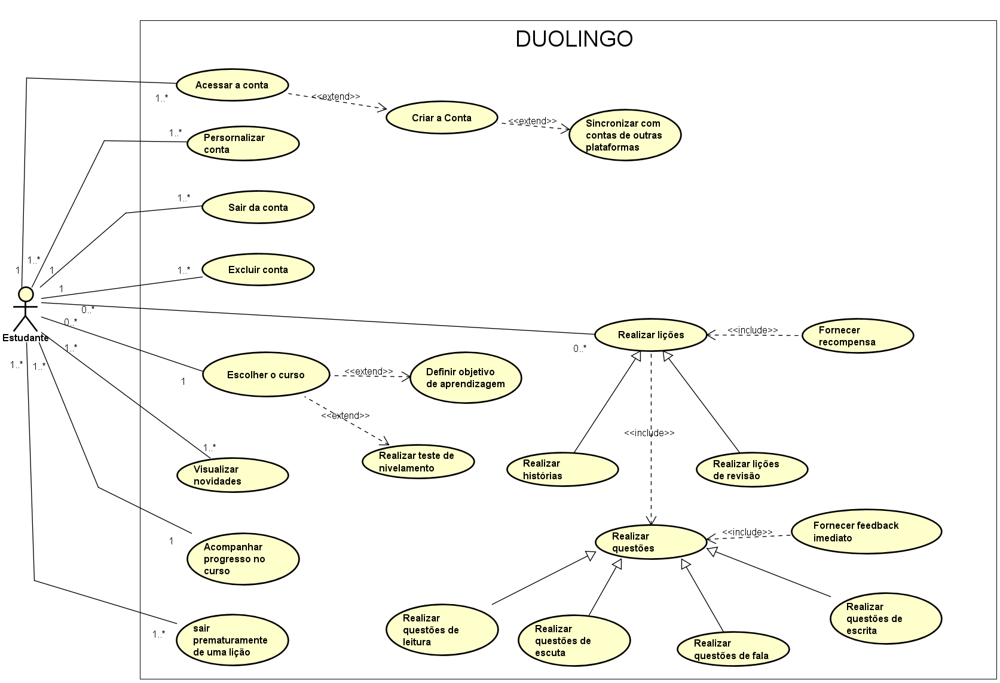

# Diagrama de Casos de Uso
A seguir, a figura do diagrama de Casos de Uso construídos com base no aplicativo Duolingo:

### **Figura 1** - Diagrama de Casos de Uso geral do Duolingo

**Autores**: [Guilherme Silva Dutra](https://github.com/GuiDutra21), [Raquel Ferreira Andrade](https://github.com/raquel-andrade), 2024

## **Especificação dos Casos de Uso**
A seguir, as tabelas das especificações de cada Caso de Uso do diagrama criado:

### Caso de Uso - Acessar a conta

| **Campo**               | **Descrição**                                                                                              |
|-------------------------|------------------------------------------------------------------------------------------------------------|
| **Caso de Uso**         | Acessar a Conta |
| **Descrição**           | O usuário acessa o aplicativo usando suas credenciais. |
| **Requisitos**          | RF04, RF21, RFN45, RFN47 |
| **Atores**              | Estudante  |
| **Frequência de Uso**   | Média |
| **Pré-condições**       | - Ter conexão à internet - O usuário deve ter o aplicativo instalado - Já ter uma conta no aplicativo |
| **Fluxo Principal**     | 1. O usuário acessa a tela de login. 2. O usuário seleciona a opção 'Já tenho uma conta'. 3. O sistema solicita e-mail e senha. 4. O usuário fornece as credenciais. 5. O sistema valida e autentica o usuário. 6. O usuário é redirecionado para a página inicial do aplicativo. |
| **Fluxos Alternativos** | **FA1 - Criar a conta** 1. O usuário acessa a tela de login. 2. O usuário seleciona a opção 'Começar' para o primeiro acesso no aplicativo, acionando o caso de uso “Criar a conta”. 3. O sistema exibe um questionário inicial para personalizar o aplicativo para o perfil do usuário. 4. Após o questionário, o sistema solicita informações de cadastro. 5. O usuário fornece os dados e é registrado no sistema. 6. O usuário é redirecionado para a página inicial do aplicativo.   **FA2 - Sincronizar com contas de outras plataformas** 1. O usuário acessa a tela de login. 2. O usuário seleciona a opção 'Já tenho uma conta'. 3. O usuário seleciona a opção de entrar com uma conta sincronizada, acionando o Caso de Uso “Sincronizar com contas de outras plataformas”. 4. Abre uma tela de confirmação de autenticação na plataforma. 5. Depois de clicar em confirmar, o usuário é redirecionado para a tela inicial do aplicativo. |
| **Fluxos de Exceção**   | **FE1 - Esqueceu a senha** 1. O usuário acessa a tela de login. 2. O sistema solicita e-mail e senha. 3. O usuário não se lembra da senha e marca a opção 'Esqueci a senha'. 4. O sistema solicita o e-mail do usuário para enviar um link para redefinir a senha. 5. Após redefinir a senha, o usuário é redirecionado para a tela de login. 6. O usuário fornece as novas credenciais e entra na conta. 7. O usuário é redirecionado para a página inicial do aplicativo.  **FE2 - Credenciais inválidas** 1. O usuário acessa a tela de login. 2. O sistema solicita e-mail e senha. 3. O usuário fornece as credenciais. 4. O sistema valida e identifica credenciais inválidas. 5. O sistema exibe uma mensagem de erro e solicita uma nova tentativa. 6. O usuário fornece novamente as credenciais. 7. O sistema valida e autentica o usuário. 8. O usuário é redirecionado para a página inicial do aplicativo. |
| **Pós-condições**       | O usuário é autenticado e pode acessar as funcionalidades do aplicativo. |
| **Data da Criação**     | 13/08  |

### Caso de Uso - Personalizar conta

| **Campo**               | **Descrição**                                                                                             |
|-------------------------|-----------------------------------------------------------------------------------------------------------|
| **Casos de Uso**        | Personalizar Conta  |
| **Descrição**           | O usuário altera os dados referentes à sua conta. |
| **Requisitos**          | RF04, RF19 |
| **Atores**              | Estudante  |
| **Frequência de Uso**   | Baixa |
| **Pré-condições**       | - Ter conexão à internet - O usuário deve ter o aplicativo instalado. - Já ter uma conta no aplicativo |
| **Fluxo principal**     | 1. O usuário entra na sua conta. 2. Vai para a página do perfil. 3. Clica no ícone de engrenagens. 4. É redirecionado para uma página de configurações. 5. O usuário habilita ou desabilita alguma das preferências. 6. Após clicar em 'Pronto', é redirecionado para a tela do perfil.|
| **Pós-condições**       | O usuário tem alguma de suas preferências da conta alterada.|
| **Data da Criação**     | 15/08 |

### Caso de Uso - Sair da conta

| **Campo**               | **Descrição**                                                                                           |
|-------------------------|---------------------------------------------------------------------------------------------------------|
| **Casos de Uso**        | Sair da conta |
| **Descrição**           | O usuário pode desconectar sua conta do aplicativo. |
| **Requisitos**          | RF04 |
| **Atores**              | Estudante |
| **Frequência de Uso**   | Baixa |
| **Pré-condições**       | - Ter acesso à internet - Ter o aplicativo instalado - Estar logado na conta no aplicativo |
| **Fluxo principal**     | 1. O usuário entra na sua conta. 2. Na aba de perfil, clica no ícone de configurações. 3. Seleciona a opção 'Sair' e é direcionado para a tela de contas no dispositivo. |                                                        |
| **Pós-condições**       | O usuário está desconectado da sua conta no aplicativo.                                                |
| **Data da Criação**     | 15/08                                                                                                 |

### Caso de Uso - Excluir conta

| **Campo**               | **Descrição**                                                                                              |
|-------------------------|------------------------------------------------------------------------------------------------------------|
| **Casos de Uso**        | Excluir conta                                                                                             |
| **Descrição**           | O usuário pode excluir definitivamente sua conta do aplicativo.                                           |
| **Requisitos**          | RF04                                                                                                     |
| **Atores**              | Estudante                                                                                                |
| **Frequência de Uso**   | Baixa                                                                                                    |
| **Pré-condições**       | - Ter conexão à internet - O usuário deve ter o aplicativo instalado. - Já ter uma conta no aplicativo |
| **Fluxo principal**     | 1. O usuário entra no aplicativo. 2. Na aba de perfil, clica no ícone de configurações. 3. Depois, clica na opção 'Perfil' e seleciona 'Excluir Conta'. 4. O sistema exibe uma mensagem de alerta sobre a exclusão da conta. 5. O usuário clica novamente em 'Excluir Conta' para confirmar a ação. 6. O usuário recebe um link no e-mail cadastrado para confirmar a exclusão da conta e a conta é excluída. |
| **Fluxos alternativos** | 1. O usuário entra no aplicativo. 2. Na aba de perfil, clica no ícone de configurações. 3. Depois, clica na opção 'Sair'. 4. Ele é redirecionado para uma tela com todas as contas registradas. 5. Ao clicar em 'Gerenciar contas' e depois em 'Remover', o usuário recebe um link no e-mail cadastrado para confirmar a exclusão da conta. 6. Depois de confirmar, a conta é excluída com sucesso. |
| **Pós-condições**       | O usuário tem a sua conta excluída permanentemente no aplicativo. |
| **Data da Criação**     | 15/08 |

### Caso de Uso - Escolher o curso 

| **Campo** | **Descrição** |
|--------------------------------------------|---------------------------------------------------------------------------------------|
| **Caso de Uso**         | Escolher o Curso |
| **Descrição**           | O usuário escolhe o idioma que deseja aprender ou praticar no aplicativo. |
| **Requisitos**          | RF01, RF19, RFN47 |
| **Atores**              | Estudante |
| **Frequência de Uso**   | Média |
| **Pré-condições**       | - O usuário deve ter conexão à internet - O usuário deve ter o aplicativo instalado - O usuário deve estar autenticado |
| **Fluxo Principal**     | 1. O usuário entra em sua conta. 2. O usuário clica na aba de cursos. 3. O sistema fornece uma lista de cursos disponíveis. 4. O usuário seleciona o idioma que deseja aprender ou praticar e é redirecionado para a página inicial com o conteúdo do idioma selecionado. |
| **Fluxos Alternativos** | **FA1 - Realizar teste de nivelamento** 1. O usuário entra em sua conta. 2. O usuário clica na aba de cursos. 3. O sistema fornece uma lista de cursos disponíveis. 4. O usuário seleciona o idioma desejado. 5. O sistema pergunta o quanto o usuário sabe do idioma. 6. O sistema exibe uma tela com as opções de começar o curso do zero ou realizar o teste de nivelamento. 7. O usuário seleciona a opção para realizar o teste de nivelamento, acionando o caso de uso “Realizar teste de nivelamento”. 8. O sistema apresenta uma série de questões para avaliar o conhecimento do usuário. 9. O usuário responde às perguntas. 10. O sistema determina o nível de proficiência e, baseado nisso, algumas seções podem ou não já estarem cumpridas automaticamente.  **FA2 - Definir Objetivo de Aprendizagem** 1. O usuário entra em sua conta. 2. O usuário acessa a aba de cursos. 3. O sistema fornece uma lista de cursos disponíveis. 4. O usuário seleciona o idioma desejado. 5. O sistema exibe as opções de objetivo para aprender o idioma, acionando o caso de uso “Definir objetivo de aprendizagem”. 6. O usuário seleciona uma das opções de objetivo e é redirecionado para a tela de lições. |
| **Pós-condições**       | O usuário seleciona o idioma para aprender ou praticar e o conteúdo é exibido conforme a escolha.   |
| **Data da Criação**     | 14/08 |

### Caso de Uso - Realizar lições

| **Campo**               | **Descrição** |
|-------------------------|-------------------------------------------------------------------------------------------------------------------------------|
| **Caso de Uso**         | Realizar Lições |
| **Descrição**           | O usuário realiza um conjunto de questões que podem envolver escrita, leitura, escuta e fala para praticar o idioma que está aprendendo. |
| **Requisitos**          | RF02, RF10, RF11, RF25, RF26, RF27, RF28, RNF35, RNF36, RNF43, RNF50 |
| **Atores**              | Estudante |
| **Frequência de Uso**   | Alta |
| **Pré-condições**       | - O usuário deve ter conexão à internet - O usuário deve ter o aplicativo instalado - O usuário deve estar autenticado. - O usuário deve possuir um curso selecionado. |
| **Fluxo Principal**     | 1. O usuário entra em sua conta. 2. O sistema exibe a tela inicial das lições. 3. O usuário seleciona uma lição disponível. 4. O sistema exibe as questões da lição escolhida para o usuário respondê-las, acionando o Caso de Uso “Realizar questões”. 5. Ao responder uma questão, o sistema fornece um feedback imediato, indicando se a resposta está correta ou errada, acionando o caso de uso “Fornecer feedback imediato”. 6. O usuário completa as questões propostas. 7. Após a finalização da lição, o sistema fornece XPs ao usuário, acionando o caso de uso "Fornecer recompensas". 8. O progresso na lição é registrado. |
| **Fluxos Alternativos** | **FA1 - O usuário escolhe pular para uma lição diferente:** 1. O usuário entra em sua conta. 2. O usuário seleciona a lição que deseja avançar na tela inicial. 3. O usuário faz um pequeno teste de nivelamento para aprovar a solicitação de avanço. 4. Caso atinja a pontuação mínima, o usuário é redirecionado para a lição que escolheu avançar. 5. O sistema exibe as questões da lição escolhida para o usuário respondê-las. 6. Após o usuário completar os exercícios propostos, o progresso na lição é registrado.  **FA2 - Realizar questões de revisão** 1. O usuário entra em sua conta. 2. O usuário seleciona a lição que deseja revisar. 3. O usuário seleciona em qual modo deseja revisar, seja o modo tradicional ou o modo Titã (caso seja o modo Titã, faz-se necessário pagar alguns cristais para isso). 4. Após selecionar o modo desejado, um conjunto de questões é apresentado. 5. A cada questão, um feedback imediato é mostrado para indicar se o usuário errou ou acertou, acionando o Caso de Uso “Fornecer feedback imediato”. 6. Após finalizar a lição de revisão, o usuário recebe as recompensas associadas, acionando o Caso de Uso “Fornecer recompensas”.  **FA3 - Realizar histórias** 1. O usuário entra em sua conta. 2. O usuário vai para a página de práticas (de revisões). 3. O usuário clica nas histórias e seleciona uma para ser realizada. 4. Um conjunto de questões é fornecido para o usuário respondê-las, acionando o Caso de Uso “Realizar questões”. 5. Ao responder uma questão, o sistema fornece um feedback imediato, indicando se a resposta está correta ou errada, acionando o caso de uso “Fornecer feedback imediato”. 6. O usuário completa as questões propostas. 7. Após a finalização da História, o sistema fornece XPs ao usuário, acionando o caso de uso "Fornecer recompensas". 8. O usuário é redirecionado para a página de Histórias, podendo revisar a última realizada. |
| **Pós-condições**       | O usuário realiza as lições e o progresso na lição é registrado. |
| **Data da Criação**     | 14/08 |

### Caso de Uso - Visualizar novidades

| **Campo** | **Descrição** |
|-------------------------|---------------------------------------------------------------------------------------------------------|
| **Casos de Uso**        | Visualizar novidades |
| **Descrição**           | O usuário consegue visualizar e até mesmo interagir com as principais notícias/novidades que o aplicativo fornece. |
| **Requisitos**          | Nenhum especificado |
| **Atores**              | Estudante |
| **Frequência de Uso**   | Baixa |
| **Pré-condições**       | - O usuário deve ter conexão à internet - O usuário deve ter o aplicativo instalado - O usuário deve estar autenticado. - O usuário deve possuir um curso selecionado. |
| **Fluxo Principal**     | 1. O usuário entra na sua conta. 2. Acessa a página de novidades. 3. Checa as novidades interagindo com elas quando possível. |
| **Pós-condições**       | O usuário consegue visualizar algumas novidades e notícias. |
| **Data da Criação**     | 15/08 |

### Caso de Uso - Acompanhar progresso no curso

| **Campo**               | **Descrição** |
|-------------------------|---------------------------------------------------------------------------------------------------------|
| **Caso de Uso**         | Acompanhar Progresso no curso |
| **Descrição**           | O usuário acompanha seu progresso e desempenho em um determinado curso, incluindo o histórico de lições concluídas. |
| **Requisitos**          | RF12, RF05, RF06 |
| **Atores**              | Estudante |
| **Frequência de Uso**   | Média |
| **Pré-condições**       | - O usuário deve ter conexão à internet - O usuário deve ter o aplicativo instalado - O usuário deve estar autenticado. - O usuário deve ter um curso em andamento. |
| **Fluxo Principal**     | 1. O usuário acessa sua conta no aplicativo. 2. Na tela inicial, ele seleciona um retângulo que indica qual seção e unidade ele está. 3. Após isso, o usuário é direcionado para uma nova tela, onde ele consegue ver todas as seções do curso selecionado e o quanto ele já realizou de cada seção. |
| **Fluxos Alternativos** | **FA1 - Checar pontuação no curso** 1. O usuário acessa sua conta no aplicativo. 2. Na tela inicial, ele seleciona o ícone do curso que está cursando. 3. Um modal aparece indicando a pontuação do usuário naquele curso. 4. Ao clicar em "saiba mais", o usuário é direcionado para uma nova tela onde contém mais detalhes sobre a relação da sua pontuação com o conhecimento e progresso na língua cursada. |                                                                                   |
| **Pós-condições**       | O progresso do usuário é exibido e atualizado conforme novas lições são concluídas. |
| **Data da Criação**     | 14/08 |

### Caso de Uso - Sair prematuramente de uma lição

| **Campo**               | **Descrição** |
|-------------------------|---------------------------------------------------------------------------------------------------------|
| **Caso de Uso**         | Sair Prematuramente de uma Lição |
| **Descrição**           | O usuário pode sair de uma lição antes de completá-la. |
| **Requisitos**          | RF20 |
| **Atores**              | Estudante |
| **Frequência de Uso**   | Baixa |
| **Pré-condições**       | - O usuário deve ter conexão à internet - O usuário deve ter o aplicativo instalado - O usuário deve ter começado uma lição. |
| **Fluxo Principal**     | 1. O usuário acessa sua conta no aplicativo. 2. O usuário inicia uma lição na tela inicial. 3. O usuário deseja sair de uma lição e seleciona a opção de sair da lição. 4. O sistema exibe as opções de continuar ou sair da lição. 5. O usuário confirma a opção de sair da lição e é redirecionado para a tela inicial do aplicativo. |
| **Fluxos Alternativos** | **FA1 - O usuário decide continuar:** 1. O usuário inicia uma lição. 2. O usuário deseja sair de uma lição e seleciona a opção de sair da lição. 3. O sistema exibe as opções de continuar ou sair da lição. 4. O usuário desiste de sair e seleciona a opção de continuar na lição. 5. É mostrado novamente a questão que o usuário estava respondendo. |
| **Pós-condições**       | O usuário sai da lição e retorna à tela principal. |
| **Data da Criação**     | 14/08 |

## Gravações

<iframe width="560" height="315" src="https://www.youtube.com/embed/y79UCbiPNlE?si=VtJ5xOF3ov88pRNy" title="YouTube video player" frameborder="0" allow="accelerometer; autoplay; clipboard-write; encrypted-media; gyroscope; picture-in-picture; web-share" referrerpolicy="strict-origin-when-cross-origin" allowfullscreen></iframe>

**Vídeo 1**: Especificação dos casos de uso

**Autores**: [Guilherme Silva Dutra](https://github.com/GuiDutra21), [Raquel Ferreira Andrade](https://github.com/raquel-andrade)

## Histórico de Versão

| Data | Versão | Descrição | Autor |
| ---- | ------ | --------- | ----- |
| 15/08/2024 | 1.0 | Criação do documento | [Raquel Ferreira Andrade](https://github.com/raquel-andrade) |
| 15/08/2024 | 1.1 | Adição das especificações dos casos de uso | [Guilherme Silva Dutra](https://github.com/GuiDutra21), [Raquel Ferreira Andrade](https://github.com/raquel-andrade) |
| 22/08/2024 | 1.2 | Adição das gravações | [Raquel Ferreira Andrade](https://github.com/raquel-andrade) |

