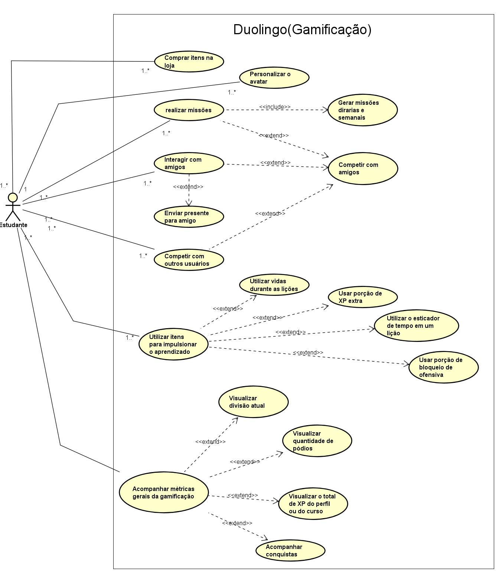

# Diagramas de Casos de Uso

A seguir, a figura do diagrama de Casos de Uso construído com base na gamificação do aplicativo Duolingo :

**Figura 2** - Diagrama do Duolingo(Gamificação)

**Autores**: [Guilherme Silva Dutra](https://github.com/GuiDutra21), [Raquel Ferreira Andrade](https://github.com/raquel-andrade), 2024

## **Especificação dos casos de uso**

A seguir, as tabelas de especificações de cada Caso de Uso do diagrama criado: 

### Caso de Uso - Comprar itens na loja

| **Campo**             |  **Descrição** |
|-----------------------|--------------------------------------------------------------------------------------------------------|
| **Caso de Uso**       | Comprar itens na loja |
| **Descrição**         | O usuário compra itens na loja, o que envolve comprar itens com dinheiro real ou com outros itens do aplicativo |
| **Requisitos**        | RF23, RF24, RNF33, RNF44 |
| **Atores**            | Estudante  |
| **Frequência de Uso** | Baixa |
| **Pré-condições**     | Conexão à internet Ter uma conta no aplicativo Ter um cartão salvo no Google Play ou Apple Store ou ter cristais suficientes para comprar outros itens da loja |
| **Fluxo principal**   | 1. O usuário loga na sua respectiva conta 2. Entra na loja fornecida pelo aplicativo 3. Seleciona o item que deseja comprar 4. Aparece uma modal de confirmação 5. Paga com cristais pelo item 6. O usuário é redirecionado para a loja e recebe o item comprado |
| **Fluxos alternativos** | **FA1 - Comprar item com dinheiro real** 1. O usuário loga na sua respectiva conta 2. Entra na loja fornecida pelo aplicativo 3. Seleciona o item que deseja comprar 4. Aparece uma modal para confirmar a compra com o cartão 5. Confirma o pagamento 6. O usuário é redirecionado para a loja e recebe o item comprado |
| **Fluxos de exceção** | **FE1 - Cartão recusado** 1. O usuário loga na sua respectiva conta 2. Entra na loja fornecida pelo aplicativo 3. Seleciona o item que deseja comprar 4. Aparece uma modal para confirmar a compra com o cartão 5. Ao tentar confirmar, aparece uma mensagem dizendo que o cartão foi recusado 6. O usuário é redirecionado para a loja  **FE2. Não tem cristais o suficiente** 1. O usuário loga na sua respectiva conta 2. Entra na loja fornecida pelo aplicativo 3. Seleciona o item que deseja comprar 4. Aparece uma modal de confirmação 5. Ao tentar confirmar a compra, aparece uma outra modal 6. Na nova modal, aparece uma mensagem dizendo que o usuário não tem cristais suficientes e opções de compra de cristais com dinheiro real são apresentadas 7. Ou o usuário clica na opção "agora não" e retorna para a loja, ou então ele compra mais cristais e depois realiza a compra do item desejado anteriormente |
| **Pós-condições**     | O usuário efetua a compra e recebe o item comprado |
| **Data da Criação**   | 13/08 |

### Caso de Uso - Personalizar o avatar
| **Campo**             | **Descrição**|
|-----------------------|---------------------------------------------------------------------------------------------------------|
| **Caso de Uso**       | Realizar missões |
| **Descrição**         | Durante a execução de algumas atividades o usuário alcança determinados marcos e, dessa forma, realiza missões |
| **Requisitos**        | RF02, RF14, RNF33 |
| **Atores**            | Estudante |
| **Frequência de Uso** | Alta |
| **Pré-condições**     | Conexão à internet Entrar na conta Ter um curso selecionado Ter missões disponíveis a serem realizadas Dependendo da missão, seguir algum amigo Ter ao menos uma lição já realizada naquela semana |
| **Fluxo principal**   | 1. O usuário entra na sua conta 2. Entra na página de missões, acionando o Caso de Uso "Gerar Missões diárias e semanais" e checa as missões disponíveis 3. Começa a realizar as lições para cumprir as missões 4. Depois de realizar uma missão, recebe a recompensa associada a ela |
| **Fluxos alternativos** | **FA1 - Missões que não envolvem a realização de lições** 1. O usuário entra na sua conta 2. Entra na página de missões, acionando o Caso de Uso "Gerar Missões diárias e semanais" e checa as missões disponíveis 3. Realiza a ação necessária para cumprir a(s) missão(ões), como exemplo, mandar um presente para um amigo, avançar numa liga e aumentar a sua ofensiva 4. Depois de realizar uma missão, recebe a recompensa associada a ela  **FA2 - Realizar uma missão entre amigos** 1. O usuário entra na sua conta 2. Entra na página de missões e checa a missão disponível em relação a um determinado amigo, acionando o Caso de Uso "Competir com amigos" 3. Realiza a ação necessária para cumprir a missão, como exemplo, mandar um presente para um amigo, avançar numa liga e aumentar a sua ofensiva 4. Depois de realizar uma missão, recebe a recompensa associada a ela 5. Além disso, salva no histórico da competição com esse amigo que o usuário realizou mais uma missão |
| **Fluxos de exceção** | **FE1 - Missão não totalmente finalizada** 1. O usuário entra na sua conta 2. Entra na página de missões, acionando o Caso de Uso "Gerar Missões diárias e semanais" e checa as missões disponíveis 3. Tenta realizar as lições ou ações associadas a uma determinada missão 4. Por algum motivo, não atinge o objetivo necessário e o tempo da missão se esgota 5. Aquela missão desaparece da lista de missões disponíveis e o usuário não recebe nenhuma recompensa por isso  **FE2 - Não tem cristais o suficiente para enviar um presente para cumprir uma missão** 1. O usuário entra na sua conta 2. Realiza a primeira lição da semana 3. Checa a aba de missões e vê que está em uma missão com o amigo 4. Nessa aba de missão com um amigo, ele clica na opção de dar um presente 5. Uma modal aparece e ele clica em confirmar o envio do presente, mas uma nova modal aparece 6. Na nova modal, aparece uma mensagem dizendo que o usuário não tem cristais o suficiente e opções de compra de cristais com dinheiro real são apresentadas 7. Ou o usuário clica na opção "agora não" e retorna para a página de missões, ou então ele compra mais cristais e depois realiza o envio do presente (item) desejado anteriormente |
| **Pós-condições**     | O usuário completa uma determinada missão e recebe uma recompensa associada a ela |
| **Data da Criação**   | 13/08 |

### Caso de Uso - Realizar Missões

| **Campo**             | **Descrição**                                                                                           |
|-----------------------|---------------------------------------------------------------------------------------------------------|
| **Caso de Uso**       | Realizar missões                                                                                        |
| **Descrição**         | Durante a execução de algumas atividades, o usuário alcança determinados marcos e, dessa forma, realiza missões.|
| **Requisitos**        | RF02, RF14, RNF33                                                                                       |
| **Atores**            | Estudante|
| **Frequência de Uso** | Alta |
| **Pré-condições**     | Conexão à internet Entrar na conta Ter um curso selecionado Ter missões disponíveis a serem realizadas Dependendo da missão, seguir algum amigo Ter ao menos uma lição já realizada naquela semana |
| **Fluxo principal**   | 1. O usuário entra na sua conta 2. Entra na página de missões, acionando o Caso de Uso "Gerar Missões diárias e semanais" e checa as missões disponíveis 3. Começa a realizar as lições para cumprir as missões 4. Depois de realizar uma missão, recebe a recompensa associada a ela |
| **Fluxos alternativos** | **FA1 - Missões que não envolvem a realização de lições** 1. O usuário entra na sua conta 2. Entra na página de missões, acionando o Caso de Uso "Gerar Missões diárias e semanais" e checa as missões disponíveis 3. Realiza a ação necessária para cumprir a(s) missão(ões), como, por exemplo, mandar um presente para um amigo, avançar numa liga e aumentar a sua ofensiva 4. Depois de realizar uma missão, recebe a recompensa associada a ela  **FA2 - Realizar uma missão entre amigos** 1. O usuário entra na sua conta 2. Entra na página de missões e checa a missão disponível em relação a um determinado amigo, acionando o Caso de Uso "Competir com amigos" 3. Realiza a ação necessária para cumprir a missão, como, por exemplo, mandar um presente para um amigo, avançar numa liga e aumentar a sua ofensiva 4. Depois de realizar uma missão, recebe a recompensa associada a ela 5. Além disso, salva no histórico da competição com esse amigo que o usuário realizou mais uma missão |
| **Fluxos de exceção** | **FE1 - Missão não totalmente finalizada** 1. O usuário entra na sua conta 2. Entra na página de missões, acionando o Caso de Uso "Gerar Missões diárias e semanais" e checa as missões disponíveis 3. Tenta realizar as lições ou ações associadas a uma determinada missão 4. Por algum motivo, não atinge o objetivo necessário e o tempo da missão se esgota 5. Aquela missão desaparece da lista de missões disponíveis e o usuário não recebe nenhuma recompensa por isso  **FE2 - Não tem cristais o suficiente para enviar um presente para cumprir uma missão** 1. O usuário entra na sua conta 2. Realiza a primeira lição da semana 3. Checa a aba de missões e vê que está em uma missão com o amigo 4. Nessa aba de missão com um amigo, ele clica na opção de dar um presente 5. Um modal aparece e ele clica em confirmar o envio do presente, mas um novo modal aparece 6. Na nova modal, aparece uma mensagem dizendo que o usuário não tem cristais suficientes e opções de compra de cristais com dinheiro real são apresentadas 7. Ou o usuário clica na opção "agora não" e retorna para a página de missões, ou então ele compra mais cristais e depois realiza o envio do presente (item) desejado anteriormente |
| **Pós-condições**     | O usuário completa uma determinada missão e recebe uma recompensa associada a ela. |
| **Data da Criação**   | 13/08 |

### Caso de Uso - Interagir com amigos

| **Campo**             | **Descrição**                                                                                           |
|-----------------------|---------------------------------------------------------------------------------------------------------|
| **Caso de Uso**       | Interagir com amigos |
| **Descrição**         | Após encontrar a conta de outra pessoa no Duolingo, você começa a segui-la e interagir com ela dentro do app |
| **Requisitos**        | RF17, RF29, RF33                                                                                        |
| **Atores**            | Estudante |
| **Frequência de Uso** | Baixa |
| **Pré-condições**     | Conexão à internet Entrar na conta Ter um curso selecionado Seguir ao menos um amigo Dependendo da interação, é necessário ter missões disponíveis a serem realizadas com um determinado amigo |
| **Fluxo principal**   | 1. O usuário entra na sua conta 2. Vai na aba de perfil 3. Seleciona a opção de adicionar amigos 4. Encontra uma outra conta e começa a segui-la 5. Por fim, essa pessoa será adicionada como um amigo |
| **Fluxos alternativos** | **FA1 -  Dar presente para um amigo** 1. O usuário entra na sua conta 2. Checa a aba de missões e vê que está em uma missão com o amigo 3. Nesse quadrado de missão com um amigo, ele clica na opção de dar um presente 4. Um modal aparece e ele gasta alguns cristais para enviar algum presente (item) para o amigo, acionando o caso de uso "Dar presente para um amigo" 5. O modal desaparece e o usuário continua na tela de missões  **FA2 -  Comemorar uma conquista de um amigo** 1. O usuário entra na sua conta 2. Acessa a página de novidades 3. Clica em "Comemore" para comemorar a conquista do amigo, acionando o caso de uso "Comemorar uma conquista de um amigo" 4. Após isso, o amigo recebe uma notificação que o usuário comemorou uma conquista dele  **FA3 - Competir com amigos** 1. O usuário entra na sua conta 2. Entra na página de missões e checa a missão disponível em relação a um determinado amigo, acionando o Caso de Uso "Competir com amigos" 3. Realiza a ação necessária para cumprir a missão, como exemplo, mandar um presente para um amigo, avançar numa liga e aumentar a sua ofensiva 4. Depois de realizar uma missão, recebe a recompensa associada a ela 5. Além disso, salva no histórico da competição com esse amigo que o usuário realizou mais uma missão |
| **Pós-condições**     | Estar seguindo a conta de uma pessoa Finalizar uma missão contra um amigo Ter comemorado uma conquista de um amigo |
| **Data da Criação**   | 15/08 |
<!-- | **Fluxos de exceção** |                                                                                                         | -->

### Caso de Uso - Competir com outros usuários

| **Campo**             | **Descrição**                                                                                           |
|-----------------------|---------------------------------------------------------------------------------------------------------|
| **Caso de Uso**       | Competir com outros usuários |
| **Descrição**         | O usuário consegue entrar em competições com outros usuários, seja um amigo ou não.                      |
| **Requisitos**        | RF14, RF16, RF17, RNF33 |
| **Atores**            | Estudante |
| **Frequência de Uso** | Alta |
| **Pré-condições**     | Conexão à internet Para competir nas ligas, o usuário deve ter realizado pelo menos 5 lições em qualquer unidade Para competir com amigos, o usuário deve possuir amigos Para as missões, o usuário deve ter realizado a primeira lição da semana |
| **Fluxo principal**   | 1. O usuário entra na sua conta 2. Acessa a tela das ligas, acionando o Caso de Uso "Competir nas ligas" 3. Checa a sua posição baseada no XP 4. Começa a fazer mais lições para aumentar ou manter a sua colocação 5. Ao final da semana, o usuário, baseado na sua colocação na liga, ou avança para a próxima, ou se mantém na mesma, ou cai para a liga anterior |
| **Fluxos alternativos** | **FA1 - Competir com amigos** 1. O usuário entra na sua conta 2. Entra na página de missões e checa a missão disponível em relação a um determinado amigo, acionando o Caso de Uso "Competir com amigos" 3. Realiza a ação necessária para cumprir a missão, como, por exemplo, mandar um presente para um amigo, avançar numa liga e aumentar a sua ofensiva 4. Depois de realizar uma missão, recebe a recompensa associada a ela 5. Além disso, salva no histórico da competição com esse amigo que o usuário realizou mais uma missão |
| **Pós-condições**     | O usuário pode receber recompensas devido às competições. O usuário pode avançar ou descer numa liga. |
| **Data da Criação**   | 14/08 |
<!-- | **Fluxos de exceção** | **Nenhum fluxo de exceção especificado.**                                                              | -->

### Caso de Uso - Utilizar itens para impulsionar o aprendizado

| **Campo**             | **Descrição**                                                                                           |
|-----------------------|---------------------------------------------------------------------------------------------------------|
| **Caso de Uso**       | Utilizar itens para impulsionar o aprendizado |
| **Descrição**         | O usuário, com o objetivo de impulsionar o seu aprendizado, utiliza itens como vidas, porções de XP, bloqueadores de ofensiva e esticadores de tempo. |
| **Requisitos**        | RF23, RF24, RNF33 |
| **Atores**            | Estudante |
| **Frequência de Uso** | Média  |
| **Pré-condições**     | Conexão à internet O usuário precisa estar na sua conta Possuir algum item, como vidas, porções, esticadores de tempo e bloqueadores de ofensiva Estar em uma lição que permita o uso de algum de seus itens |
| **Fluxo principal**   | 1. O usuário entra na sua conta 2. Começa a realizar uma lição 3. O usuário responde uma questão incorretamente 4. Uma vida é consumida automaticamente, acionando o Caso de Uso “Utilizar vidas durante as lições” 5. O usuário continua na lição com uma vida a menos |
| **Fluxos alternativos** | **FA1 - Usar porção de XP** 1. O usuário entra na sua conta 2. Vai na aba da loja 3. Consome uma porção de XP, acionando o Caso de Uso “Usar porção de XP extra” 4. Inicia uma lição 5. Finaliza uma lição 6. Se o tempo da porção ainda estiver ativo, o usuário ganha o dobro de XP naquela lição   **FA2 - Utilizar o esticador de tempo** 1. O usuário entra na sua conta 2. Inicia uma lição 3. Durante a lição, o tempo acaba 4. Um modal aparece perguntando se ele deseja utilizar um esticador de tempo 5. O usuário confirma que sim, acionando o Caso de Uso “Utilizar o esticador de tempo em uma lição” 6. O modal desaparece e o usuário continua a lição com a quantidade de tempo definida pelo esticador   **FA3 - Usar o bloqueador de ofensiva** 1. O usuário deixa de acessar o aplicativo por um dia 2. O usuário entra na sua conta 3. Um modal aparece na tela dizendo que a ofensiva foi quebrada 4. O usuário clica em utilizar um bloqueador de ofensiva, acionando o Caso de Uso “Usar porção de bloqueio de ofensiva” 5. A ofensiva continua na sua contagem, mas é registrado que ele utilizou o bloqueador para manter a frequência  **FA4 - Utilizar cristais para comprar vidas** 1. O usuário entra na sua conta 2. Percebe que há possibilidade de comprar vidas 3. Clica no ícone das vidas na tela inicial 4. Compra uma vida clicando em “Recuperar vidas” |
| **Fluxos de exceção** | **FE1 - As vidas acabam durante a realização de uma lição** 1. O usuário entra na sua conta 2. Inicia uma lição na tela inicial 3. Responde uma questão incorretamente, consumindo sua última vida restante 4. O usuário é redirecionado para comprar mais vidas 5. Após a compra, o usuário retorna à lição |
| **Pós-condições**     | O usuário impulsiona o seu aprendizado continuando uma lição, ganhando mais tempo numa lição, mantendo sua ofensiva ou dobrando o seu XP em uma determinada lição |
| **Data da Criação**   | 14/08 |

### Caso de Uso - Acompanhar métricas gerais da gamificação

| **Campo** | **Descrição** |
|-----------------------|-----------------------------------------------------------------------------------------------------------------------------------------------------------------------------------------|
| **Casos de Uso** | Acompanhar métricas gerais da gamificação |
| **Descrição**  | O usuário consegue visualizar e acompanhar algumas métricas gamificadas relacionadas ao seu histórico no app |
| **Requisitos** | RF15, RF18, RF22, RF33 |
| **Atores** | Estudante |
| **Frequência de Uso** | Alta |
| **Pré-condições**     | - Conexão à internet - O usuário precisa estar na sua conta - O usuário precisa ter um curso em andamento |
| **Fluxo principal**   | 1. O usuário entra na sua conta 2. Na página das lições ele clica no ícone do fogo (ofensiva) 3. Uma nova página aparece acionando o Caso de Uso “Visualizar ofensiva” 4. Nessa página o usuário consegue visualizar a quantidade de ofensiva que ele tem, além de ver por um calendário os dias em que estudou no aplicativo |
| **Fluxos alternativos** | **FA1 - Visualizar a divisão em que o usuário está** 1. O usuário entra na sua conta 2. Acessa a tela de ligas, acionando o Caso de Uso “Visualizar divisão atual” 3. Após isso ele vê a liga em que se encontra, a sua posição na liga, o tempo restante e um breve histórico da quantidade de posições alcançadas ou perdidas no dia  **FA2 - Visualizar a divisão em que o usuário está, o seu XP total na conta, a quantidade da sua ofensiva, e o total de pódios** 1. O usuário entra na sua conta 2. Acessa a tela de perfil 3. E na parte de visão geral visualiza a divisão em que se encontra, o seu XP total na conta, a quantidade da sua ofensiva atual, e o total de pódios  **FA3 - Visualizar conquistas** 1. O usuário entra na sua conta 2. Na página do perfil ele clica na opção de ver conquistas acionando o Caso de Uso “Acompanhar conquistas” 3. Uma nova página aparece e o usuário vê todas as suas conquistas e recordes pessoais até o momento  **FA4 - Visualizar XP em um curso específico** 1. O usuário entra na sua conta 2. Acessa a tela de perfil 3. Clica no ícone dos cursos 4. Após isso ele é direcionado para uma tela onde consegue visualizar o XP que ele possui em cada curso em específico |
| **Pós-condições**     | O usuário acompanha todas as suas métricas gamificadas relacionadas ao seu progresso |
| **Data da Criação**   | 15/08 |
<!-- | **Fluxos de exceção** | - | -->

## Gravações

<iframe width="560" height="315" src="https://www.youtube.com/embed/y79UCbiPNlE?si=VtJ5xOF3ov88pRNy" title="YouTube video player" frameborder="0" allow="accelerometer; autoplay; clipboard-write; encrypted-media; gyroscope; picture-in-picture; web-share" referrerpolicy="strict-origin-when-cross-origin" allowfullscreen></iframe>

**Vídeo 1**: Especificação dos casos de uso

**Autores**: [Guilherme Silva Dutra](https://github.com/GuiDutra21), [Raquel Ferreira Andrade](https://github.com/raquel-andrade)

## Histórico de Versão

| Data | Versão | Descrição | Autor |
| ---- | ------ | --------- | ----- |
| 14/08/2024 | 1.0 | Criação do documento | [Guilherme Silva Dutra](https://github.com/GuiDutra21), [Raquel Ferreira Andrade](https://github.com/raquel-andrade) |
| 22/08/2024 | 1.1 | Adição das gravações | [Raquel Ferreira Andrade](https://github.com/raquel-andrade) |

