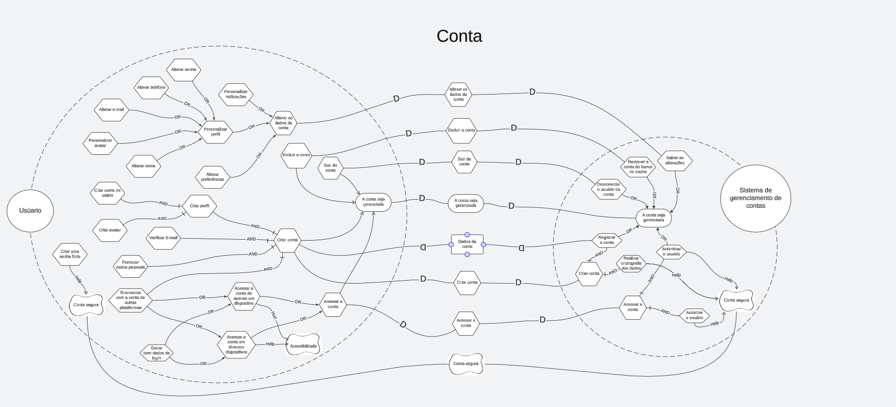
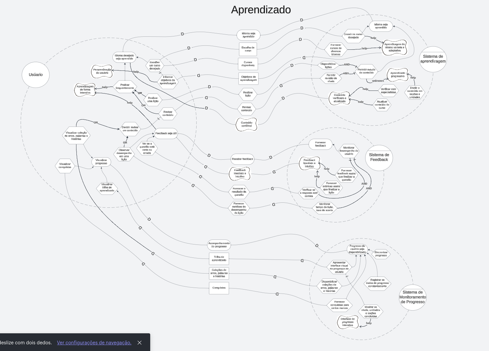
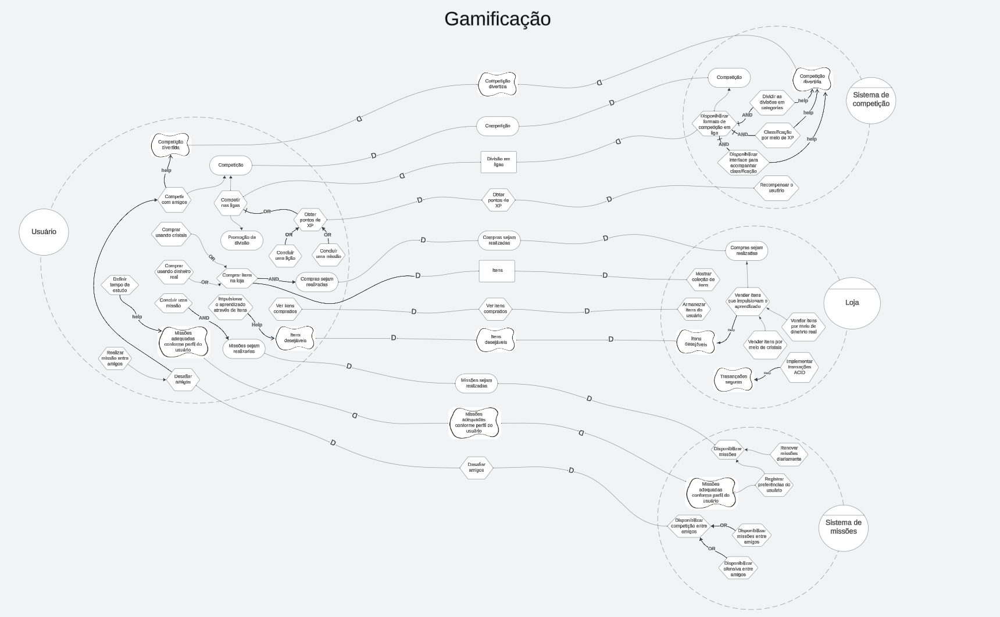

# iStar

## Introdução

O **iStar**, também conhecido i* (i-star), é um framework conceitual amplamente utilizado na Engenharia de Requisitos para lidar com sistemas sociotécnicos complexos, orientando-se pelas propriedades intencionais dos atores envolvidos no processo. As propriedades intencionais referem-se a aspectos como:

- **Metas (Goals)**: Objetivos que os atores desejam alcançar.

- **Metas-Flexíveis (Softgoals)**: Metas que não possuem critérios rígidos de sucesso e podem ser influenciadas por fatores subjetivos, como qualidade, usabilidade, ou satisfação dos envolvidos.

- **Tarefas (Tasks)**: Ações que os atores executam para alcançar suas metas.

- **Recursos (Resources)**: Elementos que os atores necessitam ou trocam entre si para atingir seus objetivos.

O framework iStar fundamenta-se em dois principais modelos:

- **Modelo Estratégico de Dependência (Strategic Dependency Model - SD)**: Representa as dependências entre atores, como um ator depende de outro para obter recursos, realizar tarefas e alcançar metas. Este modelo ajuda a entender como os diferentes agentes interagem e cooperam em um sistema.

- **Modelo de Raciocínio Estratégico (Strategic Rationale Model - SR)**: Detalha o raciocínio interno dos atores, incluindo suas metas, tarefas, recursos e decisões. Esse modelo é útil para analisar por que os atores se comportam de certas maneiras e como suas intenções influenciam suas escolhas.

O uso do iStar permite a modelagem tanto de requisitos funcionais quanto não funcionais, considerando o ambiente e as interações sociais entre os atores. Ele é particularmente útil em projetos que envolvem múltiplos stakeholders com interesses diversos, permitindo identificar conflitos e alinhar expectativas durante o levantamento de requisitos.

## Metodologia

Para modelar as funcionalidades do **Duolingo**, utilizamos a ferramenta colaborativa **LucidSpark** para criar whiteboards que representam visualmente os diagramas derivados da análise de requisitos. Esta abordagem permitiu a organização e detalhamento das interações e dependências entre os atores do sistema, baseando-se no framework iStar.

O processo teve como ponto de partida a análise dos documentos de [Product Backlog](../ModelagemAgil/product-backlog.md) e [Requisitos Elicitados](../Elicitacao/priorizacao/priorizados.md), nos quais foram identificadas as principais funcionalidades do aplicativo. A partir dessa análise, organizamos as informações para gerar diagramas coerentes e simplificados, facilitando a compreensão das necessidades e metas relacionadas ao **Duolingo**.

De forma a otimizar a representação dos dados, dividimos o iStar em três diagramas distintos, cada um abordando um tema específico e focando nos sistemas que interagem com o usuário. Esses diagramas capturam as principais dependências e intenções, descrevendo como as funcionalidades contribuem para atender às necessidades dos usuários e do sistema Duolingo como um todo.

O quadro completo pode ser acessado no link a seguir: [Quadro do iStar](https://lucid.app/lucidspark/d3b6ca17-f419-4e14-b89b-18c5c492b595/edit?viewport_loc=-7617%2C-1070%2C6400%2C3310%2C0_0&invitationId=inv_fe68aa28-b286-4c83-82f1-e357d6d1c7a7)

## Diagramas

### Gerência de Conta

Este diagrama iStar ilustra as funcionalidades relacionadas à gestão de contas dentro do aplicativo Duolingo. Nele, são representadas as dependências e metas associadas ao gerenciamento de perfis de usuários, incluindo a criação de contas, login, configurações de preferências e controle de progresso. O diagrama ajuda a entender como o sistema possibilita que o usuário gerencie sua conta de forma autônoma, assegurando que todas as necessidades relacionadas à personalização e segurança sejam atendidas.

**Figura 01**: Diagrama iStar com temática nas funcionalidades da conta

**Autores**: [Felipe Amorim de Araújo](https://github.com/lipeaaraujo), [Guilherme Silva Dutra](https://github.com/GuiDutra21), [Raquel Ferreira Andrade](https://github.com/raquel-andrade)

### Aprendizado

Este diagrama foca nas funcionalidades de aprendizado do Duolingo. Representa as metas, tarefas e recursos necessários para proporcionar uma experiência de ensino eficaz, cobrindo áreas como estruturação de lições, apresentação de conteúdo, revisão de habilidades e o acompanhamento do progresso do usuário. O modelo destaca as interações entre o usuário e o sistema, revelando como o aprendizado é suportado por diversas funcionalidades que promovem a aquisição de novos conhecimentos e habilidades linguísticas.

**Figura 02**: Diagrama iStar com temática nas funcionalidades de aprendizado

**Autores**: [Felipe Amorim de Araújo](https://github.com/lipeaaraujo), [Guilherme Silva Dutra](https://github.com/GuiDutra21), [Raquel Ferreira Andrade](https://github.com/raquel-andrade), [Julio Roberto](https://github.com/JulioR2022)

### Gamificação

Neste diagrama, são abordadas as funcionalidades relacionadas à gamificação do Duolingo. Ele detalha as metas e tarefas que envolvem a introdução de elementos lúdicos no processo de aprendizado, como o uso de pontuações, conquistas, recompensas e desafios. As dependências entre os atores, como o usuário e o sistema, estão alinhadas para garantir que a experiência de aprendizado seja engajante e motivadora, utilizando mecânicas de jogo para aumentar a retenção e o interesse.

**Figura 03**: Diagrama iStar com temática nas funcionalidades da gamificação

**Autores**: [Felipe Amorim de Araújo](https://github.com/lipeaaraujo), [Guilherme Silva Dutra](https://github.com/GuiDutra21), [Raquel Ferreira Andrade](https://github.com/raquel-andrade), [Julio Roberto](https://github.com/JulioR2022)

## Gravações

<iframe width="560" height="315" src="https://www.youtube.com/embed/XsxsToQmXF4?si=ax18HvQrJwgycK8f" title="YouTube video player" frameborder="0" allow="accelerometer; autoplay; clipboard-write; encrypted-media; gyroscope; picture-in-picture; web-share" referrerpolicy="strict-origin-when-cross-origin" allowfullscreen></iframe>

**Vídeo 1**: Criação dos Diagramas do iStar (Parte 1) 

**Autores**: [Felipe Amorim de Araújo](https://github.com/lipeaaraujo), [Guilherme Silva Dutra](https://github.com/GuiDutra21), [Raquel Ferreira Andrade](https://github.com/raquel-andrade), [Julio Roberto](https://github.com/JulioR2022)

<iframe width="560" height="315" src="https://www.youtube.com/embed/1RdYFLuXDLI?si=WJWoY6rIn_y1Lv4i" title="Realização do Rich Picture das seções" frameborder="0" allow="accelerometer; autoplay; clipboard-write; encrypted-media; gyroscope; picture-in-picture; web-share" referrerpolicy="strict-origin-when-cross-origin" allowfullscreen></iframe>

**Vídeo 2**: Criação dos Diagramas do iStar (Parte 2) 

**Autores**: [Felipe Amorim de Araújo](https://github.com/lipeaaraujo), [Guilherme Silva Dutra](https://github.com/GuiDutra21), [Raquel Ferreira Andrade](https://github.com/raquel-andrade), [Julio Roberto](https://github.com/JulioR2022)

<iframe width="560" height="315" src="https://www.youtube.com/embed/1RdYFLuXDLI?si=WJWoY6rIn_y1Lv4i" title="Realização do Rich Picture das seções" frameborder="0" allow="accelerometer; autoplay; clipboard-write; encrypted-media; gyroscope; picture-in-picture; web-share" referrerpolicy="strict-origin-when-cross-origin" allowfullscreen></iframe>

**Vídeo 3**: Criação dos Diagramas do iStar (Parte 3) 

**Autores**: [Felipe Amorim de Araújo](https://github.com/lipeaaraujo), [Guilherme Silva Dutra](https://github.com/GuiDutra21), [Raquel Ferreira Andrade](https://github.com/raquel-andrade), [Julio Roberto](https://github.com/JulioR2022)

## Histórico de Versão

| Data | Versão | Descrição | Autor |
| ---- | ------ | --------- | ----- |
| 03/09/2024 | 1.0 | Criação do documento, introdução, metodologia e diagramas | [Felipe Amorim de Araújo](https://github.com/lipeaaraujo), [Gabryel Nicolas S de Sousa](https://github.com/gabryelns), [Guilherme Silva Dutra](https://github.com/GuiDutra21), [Julio Roberto](https://github.com/JulioR2022), [Raquel Ferreira Andrade](https://github.com/raquel-andrade), [Samuel Alves Silva](https://github.com/samuelalvess) |

