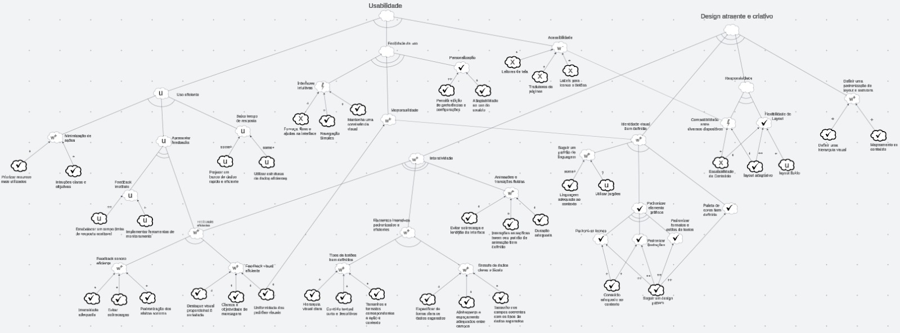

# NFR Framework

## Introdução

O NFR (Non-Functional Requirements) Framework é uma abordagem para identificar, categorizar e analisar os requisitos não funcionais de um sistema. Requisitos não funcionais são atributos de qualidade que não estão diretamente relacionados às funcionalidades específicas do sistema, mas são essenciais para o desempenho geral e a usabilidade do sistema. Esses requisitos geralmente envolvem aspectos como desempenho, segurança, usabilidade e confiabilidade.

## Metodologia

A partir dos [requisitos não funcionais](../Elicitacao/priorizacao/priorizados.md#Tabela-03-Resultado-da-Priorizacao) requisitados, foi realizada uma análise aprofundada para entender e documentar os principais aspectos críticos do sistema. Essa análise incluiu a revisão e a classificação dos requisitos em categorias como segurança,usabilidade e design.

## NFR Framework

**Imagem 1** - NFR de Design e Usabilidade  

**Autores**: [Guilherme Silva Dutra](https://github.com/GuiDutra21), [Julio Roberto](https://github.com/JulioR2022)

**Imagem 2** - NFR de Segurança 

**Autores**: [Guilherme Silva Dutra](https://github.com/GuiDutra21), [Julio Roberto](https://github.com/JulioR2022)

**Documento 1** - Link para acessar os modelos produzidos:  [NFR Framework](https://lucid.app/lucidspark/a4e9f445-64c9-4dbe-9634-9de9d57d31ab/edit?viewport_loc=-174%2C-1031%2C3456%2C1663%2C0_0&invitationId=inv_c5256f5d-b14d-48d3-b27b-6dc1738f76ab)

**Autores**: [Guilherme Silva Dutra](https://github.com/GuiDutra21), [Julio Roberto](https://github.com/JulioR2022)

## Gravação

<iframe width="560" height="315" src="https://www.youtube.com/embed/1wAFdv0ipVI?si=euaEeEUZri7I4Ja0" title="YouTube video player" frameborder="0" allow="accelerometer; autoplay; clipboard-write; encrypted-media; gyroscope; picture-in-picture; web-share" referrerpolicy="strict-origin-when-cross-origin" allowfullscreen></iframe>

**Vídeo 1**: Produção do NFR - Parte 1

**Autores**: [Guilherme Silva Dutra](https://github.com/GuiDutra21), [Julio Roberto](https://github.com/JulioR2022)

<iframe width="560" height="315" src="https://www.youtube.com/embed/QbFVbtuYoOo?si=Vfiw2qkz8qEfYsYs" title="YouTube video player" frameborder="0" allow="accelerometer; autoplay; clipboard-write; encrypted-media; gyroscope; picture-in-picture; web-share" referrerpolicy="strict-origin-when-cross-origin" allowfullscreen></iframe>

**Vídeo 2**: Produção do NFR - Parte 2

**Autores**: [Guilherme Silva Dutra](https://github.com/GuiDutra21), [Julio Roberto](https://github.com/JulioR2022)

## Referências

1. YRJÖNEN, Anton; MERILLINA, Janne. Extending the NFR Framework with Measurable Non-Functional Requirements, 2009. Disponível em:
[link](https://ceur-ws.org/Vol-553/paper2.pdf)
2. CASTRO, Jaelson. Requisitos Não-Funcionais, 2014. Disponível em: 
[link](https://www.cin.ufpe.br/~if716/arquivos20152/experimentoBruno/Aula2/Aula2-Parte2-NFR%20Framework.pdf)

## Histórico de Versão

| Data | Versão | Descrição | Autor |
| ---- | ------ | --------- | ----- |
| 22/08/2024 | 1.0 | Criação do documento | [Guilherme Silva Dutra](https://github.com/GuiDutra21), [Julio Roberto](https://github.com/JulioR2022)  |

