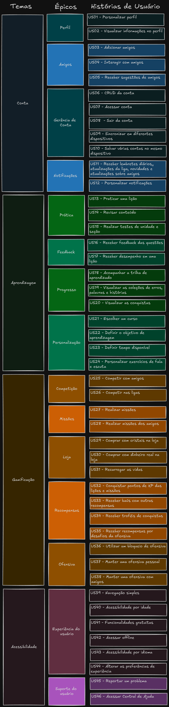

# Product Backlog

Neste documento, apresentaremos o **Product Backlog** ou **Backlog do Produto**, um dos principais artefatos da modelagem ágil baseada no **Scrum**. O **Product Backlog** é uma lista contendo todas as funcionalidades desejadas para um produto, no contexto do **Scrum** o Product Backlog seria definido pelo Product Owner e evoluído ao longo do desenvolvimento do projeto.

O Product Backlog consiste em uma tabela organizada e priorizada com tudo que precisa ser desenvolvido em um produto. O backlog contém funcionalidades, melhorias, correções de bugs, mudanças técnicas e qualquer outro item que agregue valor ao produto. Cada item do backlog é chamado **"user story"** ou **"história de usuário"**. 

## Metodologia 

A partir da análise dos [Rich Pictures](../pre-rastreabilidade.md#rich-picture) e dos [Requisitos Elicitados](../Elicitacao/priorizacao/priorizados.md) durante a etapa de elicitação foi elaborado o Product Backlog, utilizando um quadro na ferramenta Excalidraw.

A estrutura do Product Backlog foi separada em diferentes elementos de diferentes granulanidades, sendo composta pelos **Temas** que abrangem um tema ou área de funcionalidades, os **Épicos** que definem grupos de funcionalidades relacionadas, e por fim as **Histórias de Usuário** que definem de forma descrita e mais específica diferentes funcionalidades do aplicativo do Duolingo.

No quadro, que pode ser visualizado na Figura 01, fizemos a definição dos **Temas**, **Épicos** e os títulos das **Histórias de Usuário**:

**Figura 01:** Quadro do Product Backlog 

**Autores**: [Felipe Amorim de Araújo](https://github.com/lipeaaraujo), [Raquel Ferreira Andrade](https://github.com/raquel-andrade), 2024

- **Temas:** Cada tema representa uma área ampla de funcionalidades do aplicativo. Essas áreas foram identificadas a partir das necessidades centrais dos usuários e dos objetivos do aplicativo, como "Conta", "Aprendizagem", "Gamificação" e "Acessibilidade".

- **Épicos:** Dentro de cada tema, os épicos agrupam funcionalidades relacionadas de forma mais específica, descrevendo as principais capacidades que o produto deve oferecer para suportar o tema em questão. Por exemplo, dentro do tema "Gamificação", temos épicos como "Competição" e "Missões", que englobam funcionalidades voltadas para a motivação e o engajamento dos usuários por meio de elementos de jogos.

- **Histórias de Usuário:** As histórias de usuário, por sua vez, descrevem em detalhes as funcionalidades específicas do aplicativo, seguindo o formato padrão: "Como um [tipo de usuário], eu quero [funcionalidade], para que [benefício]". Essa estrutura garante que cada história esteja focada nas necessidades do usuário e nos benefícios que ele obterá ao usar o aplicativo.

Após a criação do quadro foi feito o detalhamento de cada um dos **Temas**, **Épicos** e **Histórias de Usuário**. Cada elemento com um ID que serve de identificação e rastreabilidade.

## Tabela 01 - Temas

| ID | Título | Descrição |
|----|--------|-----------|
| <a id="t01">T01</a> | Conta | Este tema aborda as funcionalidades relacionadas ao gerenciamento de contas e perfis dos usuários |
| <a id="t02">T02</a> | Aprendizagem | Este tema envolve as funcionalidades referentes ao processo de aprendizagem e prática de idiomas |
| <a id="t03">T03</a> | Gamificação | Este tema envolve estratégias e elementos de jogos para engajar e motivar os usuários |
| <a id="t04">T04</a> | Acessibilidade | Este tema abrange funcionalidades que garantem que o aplicativo seja acessível para os usuários e que eles tenham uma boa experiência na navegação |

**Autores**: [Felipe Amorim de Araújo](https://github.com/lipeaaraujo), [Raquel Ferreira Andrade](https://github.com/raquel-andrade), 2024

## Tabela 02 - Épicos

| Tema | ID | Título | Como um | Eu quero... | Para... |
|------|----|--------|---------|-------------|---------|
| [T01](#t01) | <a id="e01">E01</a> | Perfil | Estudante | Acessar e gerenciar meu perfil | Visualizar minhas informações pessoais |
| [T01](#t01) | <a id="e02">E02</a> | Amigos | Estudante | Interagir com meus amigos | Participar de competições e desafios conjuntos e compartilhar meu progresso |
| [T01](#t01) | <a id="e03">E03</a> | Gerência de conta | Estudante | Gerenciar minha conta | Manter minhas informações atualizadas e seguras |
| [T01](#t01) | <a id="e04">E04</a> | Notificações | Estudante | Receber notificações | Lembrar-me da ofensiva diária e ficar atualizado sobre os eventos e interações relevantes |
| [T02](#t02) | <a id="e05">E05</a> | Prática | Estudante | Praticar o(s) idiomas desejados | Aprender e/ou melhorar meu aprendizado |
| [T02](#t02) | <a id="e06">E06</a> | Feedback | Estudante | Receber feedback sobre as questões realizadas e o meu desempenho | Identificar erros e ajustá-los, e melhorar o meu rendimento |
| [T02](#t02) | <a id="e07">E07</a> | Progresso | Estudante | Visualizar meu progresso de aprendizado | Acompanhar meu desempenho e progresso nos cursos |
| [T02](#t02) | <a id="e08">E08</a> | Personalização | Estudante | Personalizar minha experiência de aprendizado | Adaptar o aplicativo às minhas preferências e necessidades |
| [T03](#t03) | <a id="e09">E09</a> | Competição | Estudante | Participar de competições | Testar minhas habilidades e conhecimento contra amigos e outros usuários |
| [T03](#t03) | <a id="e10">E10</a> | Missões | Estudantes | Realizar e completar missões | Manter minha motivação e obter recompensas |
| [T03](#t03) | <a id="e11">E11</a> | Loja | Estudante | Acessar a loja | Comprar itens adicionais, como vidas e cristais, e melhorar minha experiência |
| [T03](#t03) | <a id="e12">E12</a> | Recompensas | Estudante | Ganhar recompensas | Ser recompensado pelas lições, missões e competições realizadas e me manter motivado |
| [T03](#t03) | <a id="e13">E13</a> | Ofensiva | Estudante | Participar das ofensivas | Manter o compromisso de realizar as lições todos os dias e receber recompensas |
| [T04](#t04) | <a id="e14">E14</a> | Experiência de usuário | Estudante | Ter uma experiência fluida e intuitiva no aplicativo | Navegar facilmente pelo aplicativo |
| [T04](#t04) | <a id="e15">E15</a> | Suporte ao usuário | Estudante | Acessar suporte e ajuda quando necessário | Obter assistência para dúvidas e/ou dificuldades |

**Autores**: [Felipe Amorim de Araújo](https://github.com/lipeaaraujo), [Raquel Ferreira Andrade](https://github.com/raquel-andrade), 2024

## Tabela 03 - Histórias de Usuário

| Tema | Épico | ID | Título | Como um | Eu quero... | Para... | Prioridade | Status |
|------|-------|----|--------|---------|-------------|---------|------------|--------|
| [T01](#t01) | [E01](#e01) | <a id="us01">US01</a> | Personalizar perfil | Usuário do Duolingo | Personalizar meu perfil com foto e informações | Expressar minha personalidade e tornar meu perfil único | Alta | Implementado |
| [T01](#t01) | [E01](#e01) | <a id="us02">US02</a> | Visualizar informações no perfil | Usuário do Duolingo | Visualizar minhas informações de perfil, como nome e progresso | Acompanhar meu progresso e ver como os outros me veem | Média | Implementado |
| [T01](#t01) | [E02](#e02) | <a id="us03">US03</a> | Adicionar amigos | Usuário do Duolingo | Adicionar amigos na minha conta | Compartilhar meu progresso e competir com eles | Média | Implementado |
| [T01](#t01) | [E02](#e02) | <a id="us04">US04</a> | Interagir com amigos | Usuário do Duolingo | Interagir com amigos por meio de mensagens e desafios | Tornar a experiência de aprendizado mais social e competitiva | Média | Implementado |
| [T01](#t01) | [E02](#e02) | <a id="us05">US05</a> | Receber sugestões de amigos | Usuário do Duolingo | Receber sugestões de novos amigos com base nos meus interesses | Expandir minha rede social no aplicativo | Baixa | Implementado |
| [T01](#t01) | [E03](#e03) | <a id="us06">US06</a> | CRUD da conta | Usuário do Duolingo | Criar, ler, atualizar e deletar minha conta | Ter controle total sobre minha conta | Alta | Implementado |
| [T01](#t01) | [E03](#e03) | <a id="us07">US07</a> | Acessar conta | Usuário do Duolingo | Acessar minha conta de qualquer dispositivo | Continuar meu aprendizado de onde parei | Alta | Implementado |
| [T01](#t01) | [E03](#e03) | <a id="us08">US08</a> | Sair da conta | Usuário do Duolingo | Sair da minha conta de forma segura | Proteger minhas informações pessoais | Alta | Implementado |
| [T01](#t01) | [E03](#e03) | <a id="us09">US09</a> | Sincronizar em diferentes dispositivos | Usuário do Duolingo | Sincronizar meus dados de aprendizado em diferentes dispositivos | Acessar minhas informações de qualquer lugar | Média | Implementado |
| [T01](#t01) | [E03](#e03) | <a id="us10">US10</a> | Salvar várias contas no mesmo dispositivo | Usuário do Duolingo | Salvar múltiplas contas no mesmo dispositivo | Facilitar o uso compartilhado do dispositivo | Média | Implementado |
| [T01](#t01) | [E04](#e04) | <a id="us11">US11</a> | Receber lembretes diários, atualizações da liga, novidades e atualizações sobre amigos | Usuário do Duolingo | Receber notificações diárias e atualizações | Manter-me informado sobre meu progresso e novidades do aplicativo | Média | Implementado |
| [T01](#t01) | [E04](#e04) | <a id="us12">US12</a> | Personalizar notificações | Usuário do Duolingo | Personalizar quais notificações eu recebo e quando | Evitar interrupções e focar no que é importante para mim | Média | Implementado |
| [T02](#t02) | [E05](#e05) | <a id="us13">US13</a> | Praticar uma lição | Estudante de idiomas | Praticar uma lição de forma interativa | Melhorar minhas habilidades linguísticas | Alta | Implementado |
| [T02](#t02) | [E05](#e05) | <a id="us14">US14</a> | Revisar conteúdo | Estudante de idiomas | Revisar lições anteriores | Reforçar o aprendizado e corrigir erros passados | Alta | Implementado |
| [T02](#t02) | [E05](#e05) | <a id="us15">US15</a> | Realizar testes de unidade e seção | Estudante de idiomas | Fazer testes para verificar meu conhecimento em uma unidade ou seção | Avaliar meu progresso e identificar áreas de melhoria | Média | Implementado |
| [T02](#t02) | [E06](#e06) | <a id="us16">US16</a> | Receber feedback das questões | Estudante de idiomas | Receber feedback detalhado após cada questão | Compreender meus erros e aprender com eles | Alta | Implementado |
| [T02](#t02) | [E06](#e06) | <a id="us17">US17</a> | Receber desempenho em uma lição | Estudante de idiomas | Ver um resumo do meu desempenho após cada lição | Avaliar meu progresso e motivar-me a melhorar | Média | Implementado |
| [T02](#t02) | [E07](#e07) | <a id="us18">US18</a> | Acompanhar a trilha de aprendizado | Estudante de idiomas | Acompanhar meu progresso na trilha de aprendizado | Manter-me motivado e ver o quanto já evoluí | Alta | Implementado |
| [T02](#t02) | [E07](#e07) | <a id="us19">US19</a> | Visualizar as coleções de erros, palavras e histórias | Estudante de idiomas | Acessar coleções de erros comuns, palavras e histórias que já pratiquei | Focar em melhorar onde mais erro e reforçar meu vocabulário | Média | Implementado |
| [T02](#t02) | [E07](#e07) | <a id="us20">US20</a> | Visualizar as conquistas | Usuário do Duolingo | Ver minhas conquistas no aplicativo | Sentir-me recompensado e motivado a continuar | Média | Implementado |
| [T02](#t02) | [E08](#e08) | <a id="us21">US21</a> | Escolher um curso | Novo usuário | Escolher um curso de idioma de acordo com meu interesse | Iniciar meu aprendizado no idioma escolhido | Alta | Implementado |
| [T02](#t02) | [E08](#e08) | <a id="us22">US22</a> | Definir o objetivo de aprendizagem | Novo usuário | Definir um objetivo de aprendizado diário ou semanal | Manter um ritmo de estudo consistente e alcançar meus objetivos | Alta | Implementado |
| [T02](#t02) | [E08](#e08) | <a id="us23">US23</a> | Definir tempo disponível | Usuário do Duolingo | Ajustar o tempo diário que posso dedicar ao estudo | Criar um plano de estudo que se encaixe na minha rotina | Média | Implementado |
| [T02](#t02) | [E08](#e08) | <a id="us24">US24</a> | Personalizar exercícios de fala e escuta | Estudante de idiomas | Ajustar a dificuldade e frequência dos exercícios de fala e escuta | Focar nas habilidades que quero melhorar | Média | Implementado |
| [T03](#t03) | [E09](#e09) | <a id="us25">US25</a> | Competir com amigos | Usuário do Duolingo | Competir em desafios e ligas com amigos | Tornar o aprendizado mais divertido e motivador | Média | Implementado |
| [T03](#t03) | [E09](#e09) | <a id="us26">US26</a> | Competir nas ligas | Usuário do Duolingo | Participar de ligas semanais e subir no ranking | Aumentar a motivação e comparar meu progresso com outros | Alta | Implementado |
| [T03](#t03) | [E10](#e10) | <a id="us27">US27</a> | Realizar missões | Usuário do Duolingo | Completar missões diárias e semanais | Ganhar recompensas e manter a motivação | Média | Implementado |
| [T03](#t03) | [E10](#e10) | <a id="us28">US28</a> | Realizar missões dos amigos | Usuário do Duolingo | Ajudar meus amigos completando missões juntos | Tornar a experiência mais colaborativa e social | Média | Implementado |
| [T03](#t03) | [E11](#e11) | <a id="us29">US29</a> | Comprar com cristais na loja | Usuário do Duolingo | Utilizar cristais para comprar itens na loja do aplicativo | Personalizar minha experiência e obter benefícios adicionais | Média | Implementado |
| [T03](#t03) | [E11](#e11) | <a id="us30">US30</a> | Comprar com dinheiro real na loja | Usuário do Duolingo | Utilizar dinheiro real para comprar itens na loja do aplicativo | Acelerar meu progresso ou desbloquear conteúdo premium | Média | Implementado |
| [T03](#t03) | [E11](#e11) | <a id="us31">US31</a> | Recarregar as vidas | Usuário do Duolingo | Recarregar as vidas que utilizo para praticar lições | Continuar praticando sem precisar esperar | Alta | Implementado |
| [T03](#t03) | [E12](#e12) | <a id="us32">US32</a> | Conquistar pontos de XP das lições e missões | Usuário do Duolingo | Ganhar XP ao completar lições e missões | Aumentar meu nível e desbloquear recompensas | Alta | Implementado |
| [T03](#t03) | [E12](#e12) | <a id="us33">US33</a> | Receber baús com outras recompensas | Usuário do Duolingo | Receber baús com recompensas aleatórias | Aumentar o fator surpresa e me manter engajado | Média | Implementado |
| [T03](#t03) | [E12](#e12) | <a id="us34">US34</a> | Receber troféus de conquistas | Usuário do Duolingo | Ganhar troféus ao completar conquistas importantes | Sentir orgulho das minhas realizações e mostrar para os amigos | Baixa | Implementado |
| [T03](#t03) | [E12](#e12) | <a id="us35">US35</a> | Receber recompensas por desafios da ofensiva | Usuário do Duolingo | Receber recompensas ao completar desafios da ofensiva | Manter minha ofensiva ativa e ganhar prêmios | Média | Implementado |
| [T03](#t03) | [E13](#e13) | <a id="us36">US36</a> | Utilizar um bloqueio de ofensiva | Usuário do Duolingo | Usar um item para manter minha ofensiva caso eu perca um dia | Evitar a perda de progresso e manter a motivação | Média | Implementado |
| [T03](#t03) | [E13](#e13) | <a id="us37">US37</a> | Manter uma ofensiva pessoal | Usuário do Duolingo | Manter minha ofensiva de estudo ativa diariamente | Aumentar minha disciplina e compromisso com o aprendizado | Alta | Implementado |
| [T03](#t03) | [E13](#e13) | <a id="us38">US38</a> | Manter uma ofensiva com amigos | Usuário do Duolingo | Compartilhar uma ofensiva com amigos e manter o grupo engajado | Tornar o aprendizado mais colaborativo e social | Média | Implementado |
| [T04](#t04) | [E14](#e14) | <a id="us39">US39</a> | Navegação simples | Usuário do Duolingo | Navegar facilmente pelo aplicativo | Focar no aprendizado sem dificuldades técnicas | Alta | Implementado |
| [T04](#t04) | [E14](#e14) | <a id="us40">US40</a> | Acessibilidade por idade | Usuário do Duolingo | Ajustar o aplicativo para diferentes faixas etárias | Facilitar o uso por pessoas de todas as idades | Baixa | Implementado |
| [T04](#t04) | [E14](#e14) | <a id="us41">US41</a> | Funcionalidades gratuitas | Usuário do Duolingo | Acessar funcionalidades básicas sem pagar | Aprender sem precisar de uma assinatura premium | Alta | Implementado |
| [T04](#t04) | [E14](#e14) | <a id="us42">US42</a> | Acessar offline | Usuário do Duolingo | Utilizar o aplicativo mesmo sem internet | Continuar estudando em qualquer lugar, mesmo sem conexão | Média | Implementado |
| [T04](#t04) | [E14](#e14) | <a id="us43">US43</a> | Acessibilidade por idioma | Usuário do Duolingo | Ajustar o aplicativo para o idioma que eu falo | Facilitar o uso para falantes de diversos idiomas | Alta | Implementado |
| [T04](#t04) | [E14](#e14) | <a id="us44">US44</a> | Alterar as preferências de experiência | Usuário do Duolingo | Alterar as configurações do aplicativo de acordo com minhas preferências | Melhorar minha experiência e personalizar o uso do aplicativo | Média | Implementado |
| [T04](#t04) | [E15](#e15) | <a id="us45">US45</a> | Reportar um problema | Usuário do Duolingo | Reportar problemas técnicos ou de usabilidade | Ajudar a melhorar o aplicativo e evitar frustrações futuras | Alta | Implementado |
| [T04](#t04) | [E15](#e15) | <a id="us46">US46</a> | Acessar Central de Ajuda | Usuário do Duolingo | Acessar uma central de ajuda para tirar dúvidas ou resolver problemas | Resolver meus problemas com o aplicativo sem precisar de suporte direto | Alta | Implementado |

**Autores**: [Felipe Amorim de Araújo](https://github.com/lipeaaraujo), [Raquel Ferreira Andrade](https://github.com/raquel-andrade), 2024

## Gravação

<iframe width="560" height="315" src="https://www.youtube.com/embed/R_-hTZEWyb0?si=JbkErOCm7_kAMBS7" title="YouTube video player" frameborder="0" allow="accelerometer; autoplay; clipboard-write; encrypted-media; gyroscope; picture-in-picture; web-share" referrerpolicy="strict-origin-when-cross-origin" allowfullscreen></iframe>

**Vídeo 1**: Produção do Product Backlog

**Autores**: [Felipe Amorim de Araújo](https://github.com/lipeaaraujo), [Raquel Ferreira Andrade](https://github.com/raquel-andrade) 2024

## Referências

1. **[Ebrary] Young, Ralph.** *Requirements Engineering Handbook*. Norwood, US: Artech House Books, 2003.

2. **[Open Access] Leite, Julio Cesar Sampaio do Prado.** *Livro Vivo - Engenharia de Requisitos*. [Link](http://livrodeengenhariaderequisitos.blogspot.com.br/) (Último acesso: 2017).

3. **[Ebrary] Chemuturi, Murali.** *Mastering Software Quality Assurance: Best Practices, Tools and Technique for Software Developers*. Ft. Lauderdale, US: J. Ross Publishing Inc., 2010.

## Histórico de Versão

| Data | Versão | Descrição | Autor |
| ---- | ------ | --------- | ----- |
| 20/08/2024 | 1.0 | Criação do documento e tabelas de temas, épicos e histórias de usuário  | [Felipe Amorim de Araújo](https://github.com/lipeaaraujo), [Raquel Ferreira Andrade](https://github.com/raquel-andrade) |
| 22/08/2024 | 1.1 | Adicionando linkagem | [Felipe Amorim de Araújo](https://github.com/lipeaaraujo), [Raquel Ferreira Andrade](https://github.com/raquel-andrade) |

