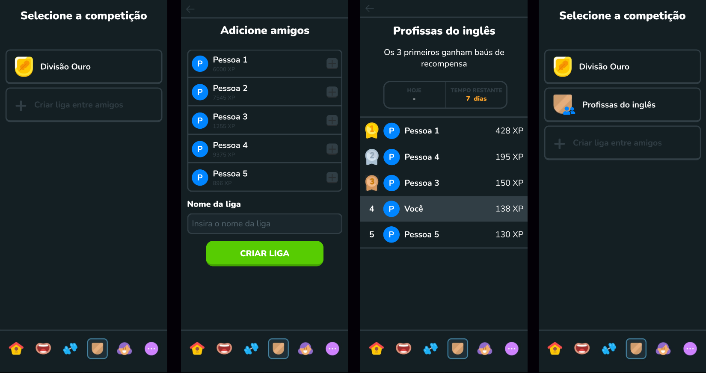

# Protótipo

## Introdução

Este documento apresenta o protótipo de uma nova funcionalidade desenvolvida para o aplicativo Duolingo, baseada em [requisitos](../../Elicitacao/priorizacao/priorizados.md#tabela-03-resultado-da-priorizacao) e [histórias de usuário](../../ModelagemAgil/product-backlog.md#tabela-03-historias-de-usuario) ainda não implementados. O protótipo foi criado com o objetivo de expandir as capacidades sociais e competitivas do aplicativo, fornecendo uma experiência de maior engajamento entre os usuários.

## Metodologia

O protótipo visa implementar as funcionalidades descritas nos seguintes [requisitos]() e [histórias de usuário]():

### Tabela 01 - Requisitos e Histórias de Usuário

| ID | Descrição ou Título |
|----|---------------------|
| [RF16](../../Elicitacao/priorizacao/priorizados.md#tabela-03-resultado-da-priorizacao) | O aplicativo deve possuir um sistema de recompensas. |
| [RF17](../../Elicitacao/priorizacao/priorizados.md#tabela-03-resultado-da-priorizacao) | O aplicativo deve incluir um sistema de amizades. |
| [US04](../../ModelagemAgil/product-backlog.md#us04) | Permitir interações entre amigos. |
| [US25](../../ModelagemAgil/product-backlog.md#us25) | Possibilitar competições entre amigos. |
| [US26](../../ModelagemAgil/product-backlog.md#us26) | Oferecer competições em formato de ligas. |

**Autor:** [Felipe Amorim de Araújo](https://github.com/lipeaaraujo)

As histórias e os requisitos listados na tabela referem-se à funcionalidade de [competição](../../Modelagem/lexico.md#competir) entre amigos no Duolingo, integrando o sistema de amizades e [competições](../../Modelagem/lexico.md#competir) em formato de [liga](../../Modelagem/lexico.md#liga).

O protótipo introduz a criação de uma [liga](../../Modelagem/lexico.md#liga) semanal, onde o [usuário](../../Modelagem/lexico.md#usuario) pode selecionar até 8 amigos para competir. A classificação segue o formato tradicional das [ligas](../../Modelagem/lexico.md#liga) do aplicativo, utilizando o [XP](../../Modelagem/lexico.md#pontos-de-xp) obtido pelos participantes.

## Protótipo

### Novas telas

Abaixo apresenta-se uma figura das novas telas implementadas no aplicativo Duolingo pelo protótipo desenvolvido, a fim de implementar as funcionalidades novas propostas:

**Figura 01** - Telas do protótipo criado

**Autores:** [Felipe Amorim de Araújo](https://github.com/lipeaaraujo)

### Figma

No embed abaixo, você pode visualizar e interagir com o protótipo desenvolvido no Figma.

<iframe style="border: 1px solid rgba(0, 0, 0, 0.1);" width="800" height="450" src="https://www.figma.com/embed?embed_host=share&url=https%3A%2F%2Fwww.figma.com%2Fproto%2FYEMf1yG5YyhrN3ljGfj7gE%2FProt%25C3%25B3tipo-do-Duolingo%3Fnode-id%3D2-98%26node-type%3DCANVAS%26t%3DxLtaewQ4Irin2MfO-1%26scaling%3Dscale-down%26content-scaling%3Dfixed%26page-id%3D0%253A1%26starting-point-node-id%3D2%253A98" allowfullscreen></iframe>

**Autores:** [Felipe Amorim de Araújo](https://github.com/lipeaaraujo)

## Histórico de Versão

| Data       | Versão | Descrição                         | Autor                                  |
|------------|--------|-----------------------------------|----------------------------------------|
| 07/09/2024 | 1.0    | Criação do documento do protótipo | [Felipe Amorim de Araújo](https://github.com/lipeaaraujo) |
| 08/09/2024 | 1.1    | Adição das figura das telas e do embed do protótipo | [Felipe Amorim de Araújo](https://github.com/lipeaaraujo) |

---

Essas alterações visam melhorar a clareza e a fluidez do texto, mantendo seu conteúdo essencial.
