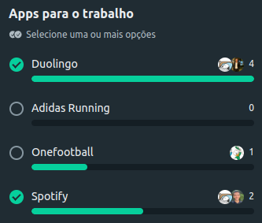

# Aplicativo Escolhido

## Enquete

O primeiro passo para a introdução e começo do projeto foi a escolha de um **aplicativo** para ser tema de nossa análise. Inicialmente, fizemos uma enquete entre os próprios membros do grupo com algumas ideias de aplicativos utilizando o Whatsapp, encontrada na figura 1.

  

  **Figura 01** - Enquete realizada entre os membros

As opções da enquete foram o Duolingo, Adidas Running, Onefootball e o Spotify. Após votação, o aplicativo escolhido pelo grupo foi o **Duolingo**

## Duolingo

O Duolingo é o aplicativo mais popular do mundo para o aprendizado de idiomas gratuito, seu lançamento aconteceu no ano de 2011 e a plataforma está disponível para aplicativo mobile e website. A seguir a logo visual do Duolingo, na figura 2.

  

  **Figura 02** - Logo do Duolingo

O Duolingo disponibiliza uma grande variedade de cursos e idiomas para aprendizado, oferencendo uma abordagem gamificada utilizando-se de recompensas, interação e competição.

O sistema do Duolingo analísa constantemente sua forma de aprendizado, criando um sistema educacional adaptativo que atende as necessidades específicas de cada usuário, utilizando de outras abordagens para manter o engajamento, diversão e a motivação ao aprender.

## Mais informações

A seguir alguns links oficiais com mais informações sobre a plataforma:

- [Duolingo: Homepage](https://pt.duolingo.com/)
- [Duolingo: Sobre o Duolingo](https://support.duolingo.com/hc/pt-br/categories/200280540-Sobre-o-Duolingo)
- [Duolingo: Quem somos](https://pt.duolingo.com/info)

## Histórico de Versão

| Data | Versão | Descrição | Autor |
| ---- | ------ | --------- | ----- |
| 31/07/2024 | 1.0 | Criação da página | [Felipe Amorim de Araújo](https://github.com/lipeaaraujo) |
| 01/08/2024 | 1.1 | Concertando as imagens | [Felipe Amorim de Araújo](https://github.com/lipeaaraujo) |

