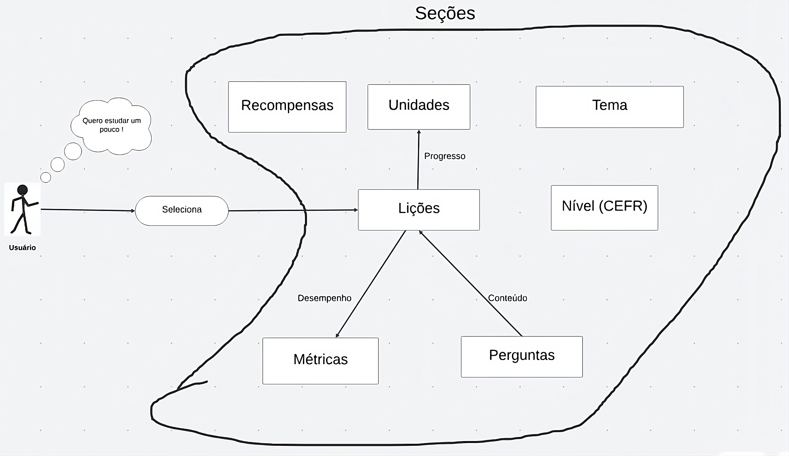

# Pré-Rastrabilidade
A pré-rastreabilidade é o processo de rastreamento e documentação das fontes de informação e influências que levam à criação de requisitos antes de suas formalizações, garantindo que as razões e contextos subjacentes a cada requisito sejam claramente compreendidos e justificáveis, dessa forma, a pré-rastreabilidade tem como principal objetivo documentar o contexto a partir do qual emergem os requistos.

Sendo assim, para a realização da pré-rastreabilidade podemos empregrar diversas técnicas, sendo as principais delas a argumentação, o Rich Picture, entrevistas com stakeholders, análise de mercado e concorrência e a análise de documentos e Normas.

## RichPicture

O rich picture é uma técnica visual utilizada principalmente na engenharia de requisitos para representar graficamente e de forma ilustrativa a complexidade e a interação entre diversos elementos de um sistema, processo ou situação.

A partir da utilização do Duolingo, e com auxílio do lucidspark, conseguimos produzir os seguintes richpictures :

**Figura 1**: Rich Picture Geral

**Autores**: [Felipe Amorim de Araújo](https://github.com/lipeaaraujo),[Gabryel Nicolas S de Sousa](https://github.com/gabryelns),[Guilherme Silva Dutra](https://github.com/GuiDutra21), [Julio Roberto](https://github.com/JulioR2022), [Raquel Ferreira Andrade](https://github.com/raquel-andrade), [Samuel Alves Silva](https://github.com/samuelalvess), 2024
  
  

**Figura 2**: Rich Picture das Seções

**Autores**: [Felipe Amorim de Araújo](https://github.com/lipeaaraujo),[Gabryel Nicolas S de Sousa](https://github.com/gabryelns),[Guilherme Silva Dutra](https://github.com/GuiDutra21), [Julio Roberto](https://github.com/JulioR2022), [Raquel Ferreira Andrade](https://github.com/raquel-andrade), [Samuel Alves Silva](https://github.com/samuelalvess) 2024

## Gravação

<iframe width="560" height="315" src="https://www.youtube.com/embed/1RdYFLuXDLI?si=WJWoY6rIn_y1Lv4i" title="Realização do Rich Picture das seções" frameborder="0" allow="accelerometer; autoplay; clipboard-write; encrypted-media; gyroscope; picture-in-picture; web-share" referrerpolicy="strict-origin-when-cross-origin" allowfullscreen></iframe>

**Vídeo 1**: Realização do Rich Picture das seções

**Autores**: [Gabryel Nicolas S de Sousa](https://github.com/gabryelns),[Guilherme Silva Dutra](https://github.com/GuiDutra21), [Julio Roberto](https://github.com/JulioR2022), [Samuel Alves Silva](https://github.com/samuelalvess) 2024

## Referências

1. CTEC2402 Software Development Project. Introducing Rich Pictures. Disponível em: <https://www.scribd.com/document/227529428/Rich-Picture-Guidelines> Acesso em 25 julho 2024.
2. Rich pictures - wiki. Disponível em: <https://requisitos-tinder.github.io/Tinder-2018-1/pre-rastreabilidade/richPictures/richPictures-VFinal/>. Acesso em: 31 jul. 2024.

## Histórico de Versão

| Data | Versão | Descrição | Autor |
| ---- | ------ | --------- | ----- |
| 25/07/2024 | 1.0 | Primeira versão do Rich Picture  | [Felipe Amorim de Araújo](https://github.com/lipeaaraujo), [Gabryel Nicolas S de Sousa](https://github.com/gabryelns), [Guilherme Silva Dutra](https://github.com/GuiDutra21), [Julio Roberto](https://github.com/JulioR2022), [Raquel Ferreira Andrade](https://github.com/raquel-andrade), [Samuel Alves Silva](https://github.com/samuelalvess) |
| 29/07/2024 | 1.1 | Criação do segundo Rich Picture | [Guilherme Silva Dutra](https://github.com/GuiDutra21), [Julio Roberto](https://github.com/JulioR2022),[Samuel Alves Silva](https://github.com/samuelalvess) |

